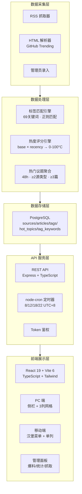
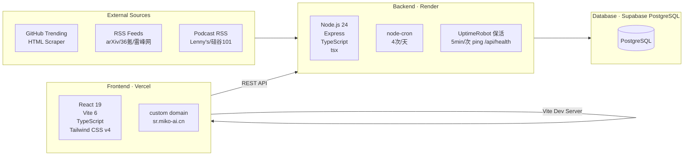
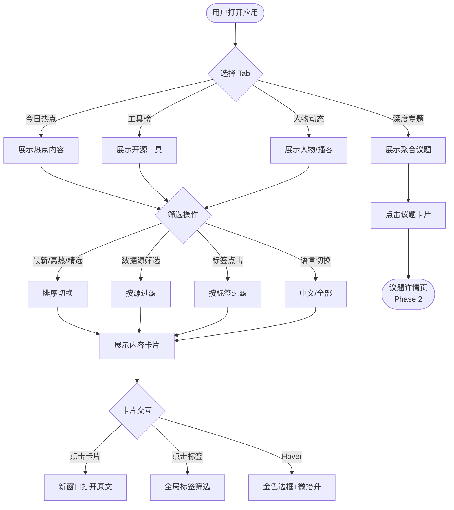

# Singularity Radar（奇点雷达）— 产品需求文档

## 1. 修订历史

| 版本 | 日期 | 作者 | 变更内容 | 评审人 |
|------|------|------|---------|--------|
| v0.1 | 2026-05-27 | Claude | 初稿 | 待评审 |
| v1.0 | 2026-06-01 | Claude | 正式发布：自定义域名、保活监控、数据新鲜度修复、部署调整 | — |

---

## 2. 需求背景与目标

### 2.1 背景描述

AI 行业信息爆炸，从业者面临严重的「信息过载」问题：
- **信源分散**：GitHub 趋势、arXiv 论文、行业资讯、深度播客分散在不同平台，每天切换多个站点消耗大量精力
- **缺乏筛选**：通用资讯平台缺少对 AI 领域的垂直深耕，低质内容与高价值信息混杂
- **缺少关联**：同一话题（如 "Agent"、"Sora"）在论文、开源项目、新闻中各自讨论，缺少跨数据源的横向聚合

### 2.2 竞品对标

| 维度 | AI Hot Today | AI Base | PrimeScope | **Singularity Radar** |
|------|-------------|---------|------------|----------------------|
| 定位 | 广度型"信息雷达" | 深度型"决策助手" | 中英文全局覆盖 | **洞察引擎，构建认知体系** |
| 数据源 | 50+ AI 信源 | 聚焦工具对比 | 30+ 权威媒体 | GitHub + arXiv + 资讯 + 播客 |
| 深度解读 | ❌ 链接聚合为主 | ✅ 结构化对比 | ⚠️ AI摘要 | **标签体系 + 热门议题聚合** |
| 大咖视角 | ❌ | ❌ | ❌ | **播客/访谈/大咖动态** |
| 视觉设计 | 偏数据工具风格 | 较重 | 标准 | **暗黑奢华风，高质感交互** |

### 2.3 产品目标（MVP）

| 优先级 | 目标 | 衡量标准 | 状态 |
|--------|------|---------|------|
| P0 | 覆盖 4+ 核心数据源，展示真实内容 | GitHub + arXiv + 36氪 + 雷峰网 成功接入 | ✅ v1.0 |
| P0 | PC/移动端响应式正常浏览 | 两端布局完整，卡片不溢出 | ✅ v1.0 |
| P0 | 标签体系可用 | 内容带标签，可按标签筛选 | ✅ v1.0 |
| P1 | 热门议题聚合 | 自动识别 1-2 个跨源热门话题 | ✅ v1.0 |
| P1 | 爆料入口 | 管理员可手动录入，前台展示 | ✅ v1.0 |
| P1 | 播客接入 | Lenny's Podcast + 硅谷101 成功接入 | ✅ v1.0 |
| P2 | 页面加载性能 | 首屏 < 3s，API < 200ms | ✅ v1.0 |
| P2 | 自定义域名 | https://sr.miko-ai.cn/ | ✅ v1.0 |
| P2 | 数据新鲜度保障 | ON CONFLICT 更新 published_at | ✅ v1.0 |

---

## 3. 用户场景

### 3.1 主场景（P0，高频核心）

**场景一：早间情报浏览**
> 作为一个 AI 从业者，每天早上我想花 5 分钟快速了解昨天发生了什么，以便把握行业动态。

- 打开首页，默认进入「今日热点」Tab
- 浏览 GitHub 热门项目、arXiv 新论文、AI 资讯混排的时间线
- 通过标题和摘要快速筛选感兴趣的内容
- 点击感兴趣的项目打开原文阅读

**场景二：按标签筛选内容**
> 作为一个关注大模型方向的开发者，我想只看 LLM 相关的内容，以便聚焦我感兴趣的领域。

- 在侧栏或卡片上看到标签（如 `#LLM`、`#Agent`、`#多模态`）
- 点击标签筛选出所有相关跨源内容
- 从论文到开源项目到资讯，一站式浏览

**场景三：移动端碎片化阅读**
> 作为一个通勤路上的从业者，我想在手机上快速刷一下今天的 AI 热点，以便不落后于行业动态。

- 手机浏览器打开站点
- 页面自适应手机宽度，Tab 收成汉堡菜单
- 上下滑动浏览卡片，信息流流畅

**场景四：热门议题深度了解**
> 作为一个技术决策者，我想看某个话题（如 Agent）在整个 AI 生态中的全貌，以便判断技术方向。

- 进入「深度专题」Tab
- 看到自动聚合的议题卡片，展示该话题在 GitHub、论文、新闻中的交叉情况
- 一站式了解该话题的多维度信息

### 3.2 次场景（P1，中频）

**场景五：管理员录入爆料**
> 作为站点管理员，我发现了一条很有价值的 AI 资讯但不在已有数据源中，我想手动录入以便补充到首页展示。

- 访问隐藏的管理页面（token 鉴权）
- 填写标题、链接、摘要、分类、配图
- 提交后内容立即展示到首页对应分类

**场景六：关注大咖播客观点**
> 作为一个追求认知深度的读者，我想看 Lenny's Podcast 等播客的最新观点，以便获取行业大佬的深度思考。

- 进入「人物动态」Tab
- 浏览最新播客内容，含标题、摘要和原文链接

### 3.3 边缘场景

- **单数据源抓取失败**：某个 RSS 源超时或返回错误，不影响其他卡片展示
- **空数据状态**：首次部署时无数据，每个卡片显示友好空状态提示
- **移动端横竖屏切换**：布局自适应不崩溃
- **内容过期**：缓存超过 3 天的内容自动淘汰，不展示过时信息
- **数据新鲜度**：连续多天上榜的 GitHub 仓库 `published_at` 更新为最新抓取时间，避免显示为过时数据

---

## 4. 产品架构

### 4.1 产品架构图



### 4.2 技术架构图



### 4.3 产品流程图



### 4.4 数据流说明

1. **定时抓取**：node-cron 在 UTC+8 8:00/12:00/18:00/22:00 触发全量抓取（共7个数据源，机器之心已禁用）
2. **抓取链路**：RSS/HTML → 解析 → 热度评分 → 标签匹配 → 入库（URL 去重，重复时更新 published_at）
3. **前端渲染**：React 请求 REST API → JSON 响应 → 骨架屏过渡 → 卡片渲染
4. **用户交互**：筛选/排序/Tab切换 → URL参数变化 → API重新请求 → 内容刷新
5. **管理员流程**：Token鉴权 → 提交爆料 → 写入DB → 刷新热门议题 → 前台可见

### 4.5 部署架构

```
用户 → https://sr.miko-ai.cn/ (Vercel)
                  ↓
          REST API → https://singularity-radar-api.onrender.com (Render)
                  ↓
            Supabase PostgreSQL (SSL)

保活: UptimeRobot → 每5分钟 ping /api/health → 防止 Render 休眠
```

---

## 5. 功能总览与模块划分

```
┌─────────────────────────────────────────────────────┐
│                     Singularity Radar                  │
├─────────────────────────────────────────────────────┤
│                                                       │
│  ┌───────────┐  ┌────────────────────────────────┐   │
│  │  导航侧栏   │  │           内容区                │   │
│  │           │  │                                │   │
│  │  ◎ 今日热点│  │  ┌─── 卡片列表 ──────────────┐ │   │
│  │  ◎ 工具榜  │  │  │  [来源][热度] [时间戳]     │ │   │
│  │  ◎ 人物动态│  │  │  标题（衬线斜体）          │ │   │
│  │  ◎ 深度专题│  │  │  摘要截断 2-3 行          │ │   │
│  │           │  │  │  #标签1 #标签2             │ │   │
│  │  ──────── │  │  │  👍 热度 来源              │ │   │
│  │  🔥 筛选   │  │  └──────────────────────────┘ │   │
│  │  最新情报  │  │  ┌─── 卡片列表 ──────────────┐ │   │
│  │  高热爆料  │  │  │  ...                      │ │   │
│  │  编辑精选  │  │  └──────────────────────────┘ │   │
│  └───────────┘  └────────────────────────────────┘   │
│                                                       │
└─────────────────────────────────────────────────────┘
```

| 模块 | 功能 | 优先级 | 说明 |
|------|------|--------|------|
| 导航侧栏 | Tab 切换（今日热点/工具榜/人物动态/深度专题） | P0 | 主导航，点击切换内容区 |
| 导航侧栏 | 筛选器（最新情报/高热爆料/编辑精选） | P0 | 对当前 Tab 内容二次筛选 |
| 导航侧栏 | 响应式收叠 | P0 | 移动端收为汉堡菜单 |
| 内容卡片 | 卡片渲染（标题/摘要/标签/来源/时间/热度） | P0 | 核心内容单元 |
| 内容卡片 | 标签显示与点击筛选 | P0 | 点击标签筛选全站内容 |
| 内容卡片 | 空/加载/错误状态 | P0 | 三种状态覆盖 |
| 顶部导航 | 品牌标识 + 爆料按钮 | P0 | 简约顶栏 |
| 热门议题聚合 | 跨数据源自动聚合 | P1 | 识别同一话题在多个源中出现 |
| 管理员爆料 | 手动录入页面 | P1 | Token 鉴权，简单表单 |
| 暗色/亮色切换 | 主题切换 | P0 | CSS 变量，localStorage 持久化 |
| 后端抓取 | RSS 定时抓取 + 去重 | P0 | node-cron 调度 |
| 后端 API | 内容查询接口 | P0 | 按 Tab/标签/筛选 查询 |
| 后端缓存 | PostgreSQL 存储 + 缓存策略 | P0 | 避免频繁请求源站 |
| **部署** | **自定义域名 sr.miko-ai.cn** | P2 | ✅ Vercel 自定义域名 |
| **运维** | **UptimeRobot 保活监控** | P2 | ✅ 每5分钟 ping Render /api/health |

---

## 5. 功能详情

### 5.1 页面布局与交互（P0）

#### 5.1.1 布局结构

**桌面端（≥768px）：两栏布局**
```
┌──────────────────────────────────────────┐
│  顶栏：品牌标识              [爆料情报]    │  ← h-16, sticky
├────────────┬─────────────────────────────┤
│            │                             │
│  导航侧栏   │  内容区 (flex-1)            │
│  w-64      │  max-w-4xl mx-auto         │
│  sticky    │                             │
│  h-screen  │  ┌─── 卡片瀑布流 ──────────┐ │
│  overflow-y │  │                         │ │
│            │  │                         │ │
│  含：       │  │                         │ │
│  · Tab导航  │  │                         │ │
│  · 筛选器   │  └─────────────────────────┘ │
│  · 装饰元素 │                             │
└────────────┴─────────────────────────────┘
```

**移动端（<768px）：单栏布局**
```
┌──────────────────┐
│ ☰  Singularity   │  ← 顶栏含汉堡菜单 + 爆料
├──────────────────┤
│                  │
│  ┌── 卡片 ────┐  │
│  │            │  │
│  └────────────┘  │
│  ┌── 卡片 ────┐  │
│  │            │  │
│  └────────────┘  │
│      ...         │
└──────────────────┘
```

#### 5.1.2 导航侧栏内容

**Tab 导航（点击切换内容区）**
| Tab | 内容 | 数据源映射 |
|-----|------|-----------|
| 今日热点 | 综合 feed，多源混排 | GitHub + arXiv + 资讯 + 播客 |
| 工具榜 | 聚焦工具/开源项目 | GitHub Trending（按语言） |
| 人物动态 | 大咖视角 | 播客/访谈（Lenny's Podcast 等） |
| 深度专题 | 热门议题聚合 | 所有数据源交叉 |

**筛选器（对当前 Tab 内容过滤）**
| 筛选项 | 说明 |
|--------|------|
| 最新情报 | 按时间倒序，默认 |
| 高热爆料 | 按热度指标排序 |
| 编辑精选 | 管理员标记（预留） |

#### 5.1.3 卡片组件设计

```
┌──────────────────────────────────────────────────┐
│ [来源标签] · [编程语言/子领域]     [时间戳]        │  ← 元数据行
│                                                  │
│  标题文字（Playfair Display，衬线斜体，~20px）     │
│  点击跳转原文（新窗口）                           │
│                                                  │
│  摘要描述文本，最多显示 3 行，超出省略号截断。    │  ← 次要信息
│  使用 Inter 字体，14px，行距 1.5                 │
│                                                  │
│  #标签1  #标签2  #标签3                           │  ← 点击筛选
│                                                  │
│  🔥 热度 90°C    via [数据源名称]                  │  ← 底部元数据
└──────────────────────────────────────────────────┘
```

**卡片交互状态：**
| 状态 | 表现 |
|------|------|
| 默认 | 背景 `#0e0e0e`，边框 `#222222`，圆角 `1.5rem` |
| Hover | 边框变为金色 `#d4af37/45`，向上微移 `-translate-y-0.5`，过渡动画 300ms |
| 加载中 | Skeleton 骨架屏，灰色脉冲动画 |
| 空数据 | 显示占位文字："暂无内容，正在雷达扫描中…" |
| 错误 | 单卡片显示 red/border 提示，不阻塞其他卡片 |

#### 5.1.4 状态覆盖

| 页面区域 | 加载态 | 空态 | 错误态 |
|---------|--------|------|--------|
| 内容卡片列表 | 3 个骨架屏卡片 | "暂无内容，雷达扫描中…" 插图 | "加载失败，点击重试" |
| 标签筛选 | 标签灰显 | "该标签暂无内容" | 标签列表 fallback |
| 热门议题 | 议题卡片 skeleton | "热门议题聚合中…" | 隐藏该模块 |
| 侧栏 Tab | 正常高亮当前 Tab | 无内容时 Tab 可切换 | 不影响导航 |
| 爆料入口 | — | — | 提交失败提示 |

### 5.2 后端数据架构（P0）

#### 5.2.1 数据库设计（PostgreSQL）

**表：sources（数据源）**
| 字段 | 类型 | 说明 |
|------|------|------|
| id | SERIAL PRIMARY KEY | 自增主键 |
| name | TEXT | 数据源名称（GitHub Trending / arXiv / 36氪 / 雷峰网 / Lenny's Podcast / 硅谷101） |
| slug | TEXT UNIQUE | 英文标识（github_trending / arxiv / 36kr / leiphone / lennys_podcast / sv101） |
| feed_url | TEXT | RSS 地址 |
| category | TEXT | 分类（opensource/paper/news/podcast） |
| update_interval | TEXT | 更新频率（daily / hourly / weekly） |
| fallback_urls | TEXT | 备用 RSS 地址，JSON 数组 |
| enabled | BOOLEAN | 是否启用 |

**表：articles（内容条目）**
| 字段 | 类型 | 说明 |
|------|------|------|
| id | SERIAL PRIMARY KEY | 自增主键 |
| source_id | INTEGER REFERENCES sources(id) | 关联 sources |
| title | TEXT NOT NULL | 标题 |
| url | TEXT NOT NULL UNIQUE | 原文链接（去重依据，带唯一索引） |
| summary | TEXT | 摘要描述 |
| author | TEXT | 作者 |
| published_at | TIMESTAMP | 发布时间（**加索引**，用于排序查询。ON CONFLICT 时更新为最新） |
| image_url | TEXT | 配图 URL（可选） |
| hot_score | INTEGER DEFAULT 0 | 热度评分 |
| is_admin_post | BOOLEAN DEFAULT FALSE | 是否为管理员手动录入 |
| is_featured | BOOLEAN DEFAULT FALSE | 编辑精选标记 |
| created_at | TIMESTAMP DEFAULT NOW() | 记录创建时间 |

**表：tags（标签）**
| 字段 | 类型 | 说明 |
|------|------|------|
| id | SERIAL PRIMARY KEY | 自增主键 |
| name | TEXT UNIQUE | 标签名（不含 #） |

**表：article_tags（文章-标签关联）**
| 字段 | 类型 |
|------|------|
| article_id | INTEGER REFERENCES articles(id) |
| tag_id | INTEGER REFERENCES tags(id) |

**表：tag_keywords（标签关键词词库）**
| 字段 | 类型 | 说明 |
|------|------|------|
| id | SERIAL PRIMARY KEY | 自增主键 |
| tag_name | TEXT | 标签名（如"大模型"） |
| keyword | TEXT UNIQUE | 匹配关键词 |
| created_at | TIMESTAMP | 创建时间 |
| updated_at | TIMESTAMP | 最后修改时间 |

**表：hot_topics（热门议题，预计算）**
| 字段 | 类型 | 说明 |
|------|------|------|
| id | SERIAL PRIMARY KEY | 自增主键 |
| keyword | TEXT UNIQUE | 聚合关键词 |
| master_title | TEXT | 主标题（从聚合文章中选取热度最高的） |
| article_ids | TEXT | 聚合文章 ID 集合，JSON 数组 |
| source_distribution | TEXT | 数据源分布，JSON 对象 |
| article_count | INTEGER | 聚合文章总数 |
| updated_at | TIMESTAMP | 本次聚合更新时间 |

> **运行机制：** 每次 node-cron 抓取完成后，最后执行 `generateHotTopics()` 函数，计算结果写入 `hot_topics` 表。前端 `GET /api/hot-topics` 直接读取该表，耗时 < 5ms。

#### 5.2.2 RSS 抓取流程

```
定时触发（node-cron：8/12/18/22 UTC+8）
       │
       ▼
  遍历启用的 sources（7个，机器之心禁用）
       │
       ▼
  请求 RSS feed（fetch + fast-xml-parser / GitHub HTML Scraper）
       │
       ├── 成功 → 解析 → 提取条目
       │         │
       │         ├── URL 去重：INSERT ... ON CONFLICT (url) DO UPDATE
       │         │   ├── 新增 → 写入完整记录
       │         │   └── 已存在 → 更新 hot_score / published_at / image_url / summary
       │         │
       │         ├── 热度评分：calculateHeatScore() 入库时一次性计算
       │         │
       │         └── 标签匹配：tagArticle() 基于 tag_keywords 词库
       │
       └── 失败 → 尝试备用 RSS 地址（fallback_urls）
                  └── 全部失败 → 记录日志，不影响其他源
```

**数据清洗：**
- 摘要提取纯文本，strip HTML tags
- URL 去重：以 `url` 字段为唯一约束
- 标签匹配：标题 + 摘要 + content:encoded 前 200 字，正则 `\bkeyword\b`（不区分大小写）
- **数据新鲜度**：ON CONFLICT 时更新 `published_at = EXCLUDED.published_at`，确保连续上榜的 GitHub 仓库时间戳保持最新

**日志记录：**
- 每次抓取输出 console.log：时间、源名称、结果（OK/FAIL）、新增条数、耗时
- Render Dashboard 提供日志查看

**冷启动：**
- 首次部署：服务器启动时自动执行 runSchema() + runSeed() + fetchAll()
- 后续重启：启动时自动触发首次抓取，不依赖 cron 定时等待
- 注：启动抓取与 HTTP 服务器启动并行，避免阻塞 Render 健康检查

**GitHub Trending 特殊处理：**
- 与 RSS 源不同，GitHub Trending 使用 HTML Scraper 直接解析 `github.com/trending`
- `published_at` 设为 `new Date()`（抓取时间）而非文章原始发布时间
- 因此 ON CONFLICT 时更新 `published_at` 对 GitHub Trending 尤为重要

#### 5.2.3 API 接口

| 方法 | 路径 | 说明 | 鉴权 | 参数 |
|------|------|------|------|------|
| GET | /api/articles | 获取文章列表 | 无 | `tab`, `tag`, `filter`, `source`, `lang`, `days`, `page`, `limit` |
| GET | /api/articles/:id | 获取文章详情 | 无 | — |
| GET | /api/tags | 获取所有标签 | 无 | — |
| GET | /api/hot-topics | 获取热门议题聚合 | 无 | — |
| GET | /api/sources | 获取数据源状态 | 无 | — |
| GET | /api/health | 健康检查 / UptimeRobot 保活 | 无 | — |
| POST | /api/admin/articles | 管理员录入爆料 | Bearer Token | title, url, summary, tags, category, image_url |
| POST | /api/admin/fetch | 手动触发全量抓取 | Bearer Token | — |
| POST | /api/admin/retag | 全量重新打标签 | Bearer Token | — |
| POST | /api/admin/reheat | 全量重算热度评分 | Bearer Token | — |
| GET | /api/admin/stats | 数据统计概览 | Bearer Token | — |

**统一响应格式（含分页）：**
```json
{
  "data": [],
  "pagination": {
    "page": 1,
    "limit": 20,
    "total": 156,
    "totalPages": 8
  },
  "error": null
}
```

#### 5.2.4 热度评分算法

卡片上展示的"热度 90°C"为视觉元素，后端定义伪热度公式：

```
hot_score = base_score × recency_boost

base_score（数据源基础权重）:
  - GitHub Trending: 65（基础分）+ star_count / 10000（增量）
  - arXiv 论文: 55
  - 36氪: 60（中文 AI 媒体权重）
  - 雷峰网: 50
  - Lenny's Podcast: 70（独特性加成）
  - 硅谷101: 60
  - 管理员爆料: 75（人工录入默认较高）

recency_boost（时间衰减）:
  - 12 小时内: 1.5
  - 24 小时内: 1.3
  - 48 小时内: 1.1
  - 超过 48 小时: 1.0
```

**前端展示：** hot_score 线性等比映射到 0~100°C，当前批次最高分 = 100°C，其他按比例折算。

**排序策略：**
- `hot_score` 在入库时一次性计算并写入数据库，之后不再修改
- 按"高热爆料"筛选时，限定查询 `最近 3 天` 的数据，按 `hot_score DESC` 排序
- 按"最新情报"筛选时，按 `published_at DESC` 排序

### 5.3 热门议题聚合（P1）

**方案：基于关键词共现的轻量聚合（无需 NLP 模型）**

```
抓取入库 → 提取标题/摘要中的已定义关键词 → 统计跨源共现 → 热度排序 → 聚合展示
```

**具体逻辑：**
1. 每次新文章入库时，提取标题/摘要中匹配的关键词（复用标签词库）
2. 统计**最近 48 小时**内，同一关键词在 ≥2 种不同数据源类型中出现的情况
3. 聚合阈值：**同一关键词在 ≥2 个不同源类型中出现，且总文章数 ≥3 条**
4. 聚合展示形式：议题卡片采用 **双行标题** 机制：
   - **主标题：** 从聚合的文章中选取热度最高或标题最吸引人的一篇
   - **副标题：** 标注 `话题：#Agent · 共 X 篇跨源探讨`
5. 议题卡片展示在「深度专题」Tab 中

**示例：**
```
┌─────────────────────────────────────────────┐
│  AgentKit：一个轻量级AI Agent框架           │  ← 主标题
│  话题：#Agent · 共 4 篇跨源探讨             │  ← 副标题
│                                             │
│  📦 GitHub   AgentKit 框架                  │
│  📄 arXiv    Agent 推理优化论文              │
│  📰 36氪     Agent 落地分析文章              │
└─────────────────────────────────────────────┘
```

**置顶/头条机制（深度专题页顶部大卡片）：**
- **自动规则（默认）**：取过去 24 小时内 `hot_score` 最高且包含配图的文章
- **手动覆盖**：管理员通过爆料功能录入的文章，若设置 `is_featured = true`，无条件压制自动流
- **降级**：若过去 24 小时内无符合条件的内容，顶部大卡片隐藏

### 5.4 管理员爆料（P1）

**访问方式：** 页面底部"我要爆料"按钮 → `/admin` 路径
**鉴权流程：**
1. 访问 `/admin` 时，先显示 Token 输入框
2. 管理员手动输入 `ADMIN_TOKEN`，存入 `sessionStorage`
3. 后续请求 `/api/admin/*` 时，Header 附带 `Authorization: Bearer <TOKEN>`
4. 后端校验，一致则放行，否则返回 403
5. 失败 3 次后提示"请刷新页面重试"

**页面内容：** 简易表单
| 字段 | 类型 | 必填 | 说明 |
|------|------|------|------|
| 标题 | text | ✅ | 文章标题 |
| 原文链接 | url | ✅ | 跳转原文 |
| 摘要 | textarea | ✅ | 简短描述 |
| 分类 | select | ✅ | 开源/论文/资讯/播客 |
| 配图 | url | 否 | 图片链接 |
| 标签 | text | 否 | 逗号分隔 |

提交后写入 articles 表，`is_admin_post = true`，卡片带红色 `[爆料]` 角标。

**管理员功能一览：**
- 录入爆料文章（手动填写标题/链接/摘要/分类/配图）
- 手动触发全量抓取（`POST /api/admin/fetch`）
- 全量重新打标签（`POST /api/admin/retag`，修改词库后触发）
- 全量重算热度评分（`POST /api/admin/reheat`）
- 查看数据统计概览（`GET /api/admin/stats`）

---

## 6. 异常和边界场景

### 6.1 数据源异常
| 场景 | 处理方式 |
|------|---------|
| RSS 请求超时（>15s） | 跳过该源，记录日志，不影响其他源 |
| RSS 返回空条目 | 跳过更新，保留上次缓存数据 |
| RSS 格式不兼容 | 尝试备用 RSS 地址，失败则标记为 FAIL |
| 单卡片加载失败 | 前端 catch 错误，不阻塞列表 |
| GitHub Trending HTML 结构变更 | 解析返回 0 条，记录日志，下次重试 |
| **数据新鲜度**：连续多天上榜的仓库 `published_at` 过时 | ON CONFLICT 时更新 `published_at` |

### 6.2 API 异常
| 场景 | HTTP 状态码 | 响应体 |
|------|------------|--------|
| 参数校验失败 | 400 | `{ error: "invalid params" }` |
| 资源不存在 | 404 | `{ error: "not found" }` |
| 服务器内部错误 | 500 | `{ error: "internal error" }` |
| 管理员 token 错误 | 403 | `{ error: "forbidden" }` |

### 6.3 运维边界
- **Render 休眠**：免费版 15 分钟无流量休眠，冷启动约 30s
- **保活方案**：UptimeRobot 每 5 分钟 ping `/api/health`，防止服务休眠
- **启用后首次访问**：若保活已生效，服务持续运行，无需冷启动等待
- **并发抓取冲突**：PostgreSQL 原生支持并发读写，无需特殊配置
- **URL 重复**：以 URL 为唯一约束，`ON CONFLICT` 自动更新
- **部署后首次运行**：启动时触发首次全量抓取
- **数据库备份**：Supabase 自动备份

---

## 7. 非功能性需求

### 7.1 性能指标
| 指标 | 目标 | 实际 |
|------|------|------|
| 首屏加载时间 | < 3s（Vercel CDN） | ✅ 达标 |
| API 响应时间（缓存命中） | < 200ms | ✅ 达标 |
| 数据缓存 TTL | 72 小时 | ✅ 达标 |
| RSS 全量抓取（P0 所有源） | < 30s | ✅ ~25s |
| RSS 全量抓取（含 P1 源） | < 60s | ✅ ~45s |

### 7.2 安全要求
- 管理员页面通过环境变量 `ADMIN_TOKEN` 鉴权
- 所有跳转原文使用 `target="_blank" rel="noopener noreferrer"`
- 不收集任何用户个人信息
- 无 Cookie / Session

### 7.3 兼容性要求
| 端 | 要求 |
|----|------|
| PC 浏览器 | Chrome / Firefox / Safari / Edge 最新版 |
| 移动端浏览器 | iOS Safari / Android Chrome 最新版 |
| 屏幕尺寸 | 320px ~ 1920px+ 自适应 |

### 7.4 版权合规
- 仅展示标题和摘要（< 200 字）
- 所有链接新窗口跳转原文
- 页面底部注明数据来源和版权归属
- 非商用用途

---

## 8. 接口依赖与第三方说明

| 接口/服务 | 提供方 | 类型 | 关键路径 | 备注 |
|-----------|--------|------|---------|------|
| GitHub Trending | GitHub | HTML Scraper | ✅ 是 | 直接解析 github.com/trending HTML |
| arXiv cs.AI | arXiv.org | RSS | ✅ 是 | `https://rss.arxiv.org/rss/cs.AI` |
| 36氪 | 36氪 | RSS | ✅ 是 | `https://36kr.com/feed`，AI 内容过滤 |
| 雷峰网 | 雷峰网 | RSS | ✅ 是 | `https://www.leiphone.com/feed` |
| Lenny's Podcast | Substack | RSS | ❌ 否 | `https://www.lennysnewsletter.com/feed` |
| 硅谷101 | Fireside | RSS | ❌ 否 | Fireside RSS 标准地址 |
| Vercel | Vercel Inc. | 前端托管 + 自定义域名 | ✅ 是 | 自定义域名 `sr.miko-ai.cn` |
| Render | Render Inc. | 后端托管 | ✅ 是 | API 服务，免费版 15 分钟无流量休眠 |
| Supabase PostgreSQL | Supabase Inc. | 数据库 | ✅ 是 | 免费版 500MB 存储，SSL 连接 |
| UptimeRobot | UptimeRobot Inc. | 保活监控 | ✅ 是 | 每 5 分钟 ping /api/health |

---

## 9. 数据字典

### 9.1 前端组件 Props

| 组件 | 属性 | 类型 | 说明 |
|------|------|------|------|
| ArticleCard | article | Article | 文章数据对象 |
| | onTagClick | (tag: string) => void | 标签点击回调 |
| | variant | 'default' / 'compact' / 'hero' | 卡片样式变体 |
| | layout | 'vertical' / 'horizontal' | 卡片布局方向 |
| Sidebar | activeTab | TabType | 当前 Tab |
| | activeFilter | FilterType | 当前筛选 |
| | onTabChange | (tab: TabType) => void | Tab 切换 |
| | onFilterChange | (filter: FilterType) => void | 筛选切换 |
| | sources | Source[] | 数据源列表 |
| | tags | Tag[] | 标签列表 |
| Skeleton | count | number | 骨架屏数量 |
| | variant | 'default' / 'compact' | 骨架屏样式 |
| EmptyState | message | string | 空状态提示 |
| | onRetry | (() => void) | 重试回调 |
| HotTopicCard | topic | HotTopic | 热门议题数据 |
| | onTagClick | (tag: string) => void | 标签点击回调 |

### 9.2 后端数据模型

参见 5.2.1 数据库设计。

---

## 10. 测试验收标准

### 10.1 功能验收（P0 完整可用）
- [x] GitHub Trending 卡片展示 ≥10 条真实项目，含标题/描述/星数/语言
- [x] arXiv 论文列表正常展示
- [x] 36氪/雷峰网资讯正常抓取展示
- [x] 标签显示在卡片上，点击正确筛选
- [x] 4 个 Tab 切换正常，内容对应正确
- [x] 筛选器（最新/高热/精选）切换正常
- [x] 侧栏移动端收叠正常
- [x] Lenny's Podcast / 硅谷101 播客卡片正常展示
- [x] 管理员爆料录入 + 前台展示 + 红色角标
- [x] 自定义域名 `sr.miko-ai.cn` 正常访问

### 10.2 体验验收
- [x] 页面加载流畅，无白屏闪烁
- [x] 卡片 hover 效果（金色边框 + 微抬升）正常
- [x] 暗色/亮色模式切换正常
- [x] 移动端卡片间距和阅读体验良好
- [x] 骨架屏/空态/错误态显示友好

### 10.3 兼容性验收
- [x] Chrome / Safari / Firefox 最新版正常
- [x] iOS Safari / Android Chrome 正常
- [x] 320px ~ 1920px 布局不崩溃

### 10.4 性能与运维验收
- [x] 首屏加载 < 3s（Vercel CDN）
- [x] API 响应 < 200ms
- [x] RSS 全量抓取 < 60s
- [x] UptimeRobot 保活生效，服务持续运行
- [x] GitHub Trending `published_at` 随抓取更新

---

## 附录

### A. 视觉设计规范
- **配色方案**
  - 背景：`#0c0c0c`（暗色）/ `#f5f5f0`（亮色）
  - 表面：`#0a0a0a` / `#111111` / `#0e0e0e`
  - 品牌金：`#d4af37`
  - 正文：`#ececeb`（暗色）/ `#1a1a1a`（亮色）
  - 辅助文：`#8a8a8a`
  - 边框：`#222222` / `#262626`
- **字体**
  - 标题：`'Playfair Display', Georgia, 'Nimbus Roman No9 L', 'Songti SC', serif`
  - 正文：`'Inter', -apple-system, BlinkMacSystemFont, 'PingFang SC', sans-serif`
  - 标签/元数据：`'JetBrains Mono', 'Fira Code', monospace`
- **圆角**：卡片 1.5rem（3xl），按钮 0.5rem（lg）到 9999px（胶囊）

### B. V1.0 变更记录

| 变更 | 类型 | 说明 |
|------|------|------|
| 自定义域名 | 部署 | https://sr.miko-ai.cn/，Vercel 自定义域名配置 |
| 保活监控 | 运维 | UptimeRobot 每 5 分钟 ping Render /api/health |
| 数据新鲜度修复 | Bugfix | ON CONFLICT 时更新 published_at，解决 GitHub Trending 时间戳停滞 |
| 分离部署 | 架构 | Vercel（前端）+ Render（后端+数据库）分离部署 |
| 亮色模式 | 功能 | CSS 变量 + localStorage 持久化，支持暗色/亮色切换 |
| 36氪 AI 过滤 | 优化 | 仅保留 AI 相关文章，过滤财经/股市噪音 |
| 手动抓取 | 管理 | 新增 POST /api/admin/fetch 接口 |
| 全量重算热度 | 管理 | 新增 POST /api/admin/reheat 接口 |

### C. 竞品参考列表
| 产品 | 网址 | 参考价值 |
|------|------|---------|
| AI Hot Today | aihot.today | 信源选取策略 |
| PrimeScope | primescope.ai | 中英双语信源覆盖 |
| Horizon GitHub | github.com/Thysrael/Horizon | 开源架构参考 |
| OpenTrends | GitHub 开源 | 主题分组思路 |
| Di.gg | di.gg/ai | 大咖影响力追踪理念 |
