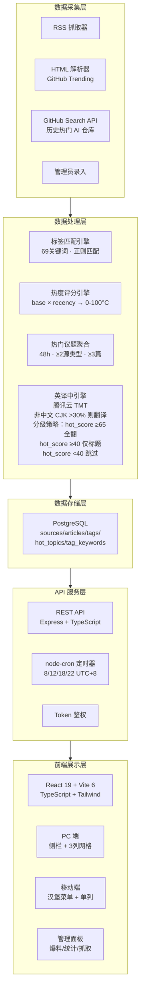
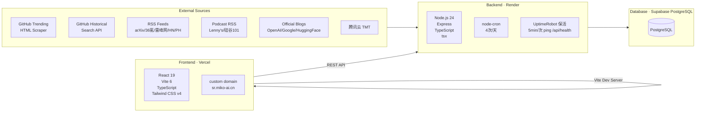
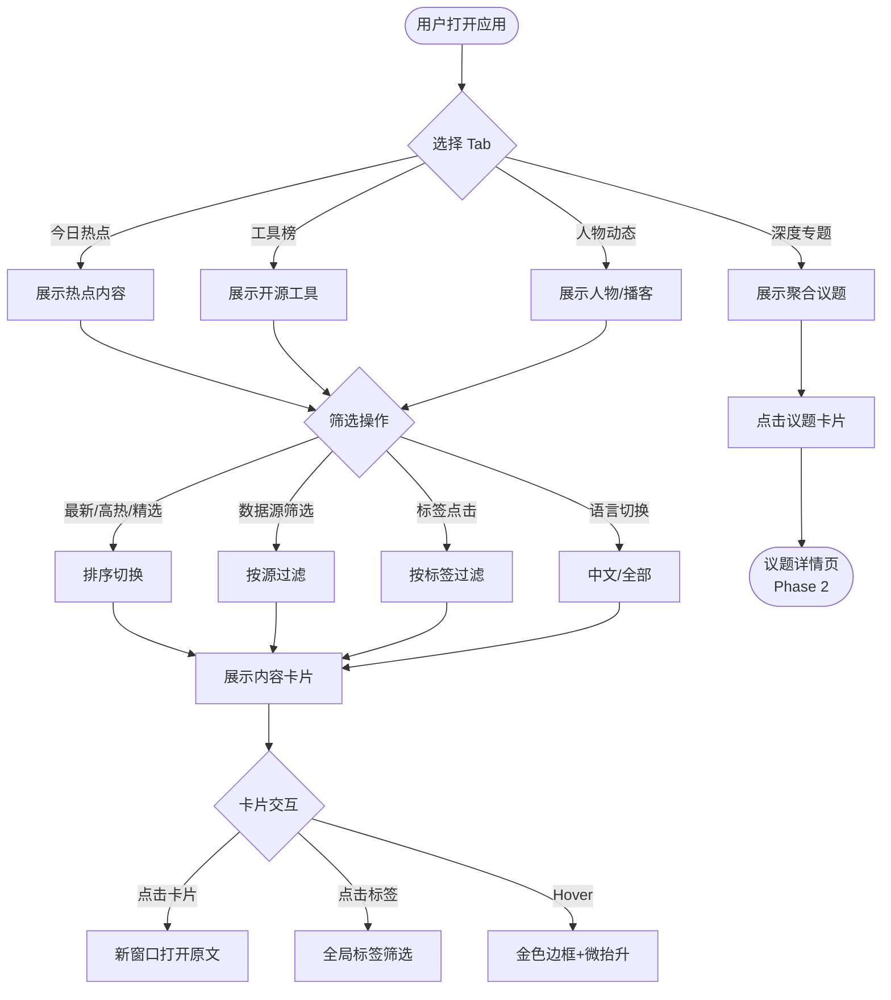

# Singularity Radar（奇点雷达）— 产品需求文档

## 1. 修订历史

| 版本 | 日期 | 作者 | 变更内容 | 状态 | 评审人 | 评审完成时间 |
|------|------|------|---------|------|------|------------|
| v0.1 | 2026-05-27 | Claude | 初稿 | 已归档 | miko | 2026-05-29 |
| v1.0 | 2026-06-01 | Claude | 正式发布：自定义域名、保活监控、数据新鲜度修复、部署调整 | **已发布** | miko | 2026-06-01 |
| v1.1 | 2026-06-02 | Claude | 英文翻译、GitHub 历史热门 AI 仓库、爆料编辑/预览/验证、新增 RSS 数据源、热度评分平衡调整、置顶衰减 | **已发布** | miko | 2026-06-02 |
| v1.1.1 | 2026-06-04 | Claude | 翻译引擎切换腾讯TMT、分级翻译策略、数据源打散排序、前端默认排序调整、GitHub Trending 发布时间修复、热度评分上调（含今日星数加成） | **已发布** | miko | 2026-06-04 |
| v1.1.2 | 2026-06-05 | Claude | 翻译配额迁移DB（修复Render部署重置）、分级策略收紧≥80/≥60、自动暂停+管理员开关、Schema UPDATE幂等修复 | **已发布** | miko | 2026-06-05 |

---

> ### V1.1 新增功能速览
> 以下为 V1.1 版本的全部新增功能，文档中以 `(v1.1)` 标记区分：
>
> | # | 功能 | 优先级 | 所在章节 |
> |---|------|--------|---------|
> | 1 | **英文内容翻译（腾讯TMT）**：腾讯云 TMT 翻译，限速 5 req/s，异步队列批量处理。分级策略：按 hot_score + 数据源决定翻译范围（标题+摘要/仅标题/跳过） | P0 | [§5.5](#55-英文内容翻译p0-v11) |
> | 2 | **GitHub 历史热门 AI 仓库**：常青榜（Top 20-30 经典项目）+ 新锐榜（近 30 天增量最快项目），分区展示 | P0 | [§5.6](#56-github-历史热门-ai-仓库p0-v11) |
> | 3 | **爆料编辑/预览/验证**：PATCH API + 实时卡片预览 + 前端表单校验 | P0 | [§5.7](#57-管理员爆料编辑预览p0-v11) |
> | 4 | **新增 RSS 数据源**：Product Hunt（AI 关键词过滤）、Hacker News、OpenAI Blog、Google AI Blog、HuggingFace Blog | P0 | [§5.8](#58-新增-rss-数据源p0-v11) |
> | 5 | **管理员置顶机制**：置顶/取消置顶 + 热度衰减（99→95→90→85→普通），"置顶"红色角标 | P0 | [§5.4](#54-管理员爆料p1) |
> | 6 | **热度评分平衡**：GitHub 星数分档上调（floor 20→35）、今日星数加成（上限+15）、加分收窄 5→3、长青榜封顶 70°C | P0 | [§5.2.4](#524-热度评分算法) |
> | 7 | **数据源打散排序**：penalty 算法，windowSize=3 惩罚同源文章 18 分，高热模式下生效 | P0 | [§5.2.4](#524-热度评分算法) |
> | 8 | **翻译引擎切换腾讯TMT**：百度翻译额度耗尽后切换到腾讯云 TMT，引入 330ms 间隔限速 | P0 | [§5.5](#55-英文内容翻译p0-v11) |
> | 9 | **前端默认排序调整**：默认展示"最新情报"，中文筛选默认关闭，偏好 localStorage 持久化 | P0 | [§5.1.2](#512-导航侧栏内容) |
> | 10 | **翻译配额 DB 持久化**：配额迁移 PostgreSQL，消除 Render 部署重置问题 | P0 | [§5.5](#55-英文内容翻译p0-v11) |
> | 11 | **翻译自动暂停 + 管理员开关**：额度耗尽自动暂停，Admin 页面手动恢复 | P0 | [§5.5](#55-英文内容翻译p0-v11) |
> | 12 | **翻译/历史仓库/新源对应的验收标准** | — | [§10.5](#105-v11-验收) |

---

## 2. 需求背景与目标

### 2.1 背景描述

AI 行业信息爆炸，从业者面临严重的「信息过载」问题：
- **信源分散**：GitHub 趋势、arXiv 论文、行业资讯、深度播客分散在不同平台，每天切换多个站点消耗大量精力
- **缺乏筛选**：通用资讯平台缺少对 AI 领域的垂直深耕，低质内容与高价值信息混杂
- **缺少关联**：同一话题（如 "Agent"、"Sora"）在论文、开源项目、新闻中各自讨论，缺少跨数据源的横向聚合

### 2.2 竞品对标

| 维度 | AI Hot Today | AI Base | PrimeScope | **Singularity Radar** |
|------|-------------|---------|------------|----------------------|
| 定位 | 广度型"信息雷达" | 深度型"决策助手" | 中英文全局覆盖 | **洞察引擎，构建认知体系** |
| 数据源 | 50+ AI 信源 | 聚焦工具对比 | 30+ 权威媒体 | GitHub + arXiv + 资讯 + 播客 |
| 深度解读 | ❌ 链接聚合为主 | ✅ 结构化对比 | ⚠️ AI摘要 | **标签体系 + 热门议题聚合** |
| 大咖视角 | ❌ | ❌ | ❌ | **播客/访谈/大咖动态** |
| 视觉设计 | 偏数据工具风格 | 较重 | 标准 | **暗黑奢华风，高质感交互** |

### 2.3 产品目标（MVP）

| 优先级 | 目标 | 衡量标准 | 状态 |
|--------|------|---------|------|
| P0 | 覆盖 4+ 核心数据源，展示真实内容 | GitHub + arXiv + 36氪 + 雷峰网 成功接入 | ✅ v1.0 |
| P0 | PC/移动端响应式正常浏览 | 两端布局完整，卡片不溢出 | ✅ v1.0 |
| P0 | 标签体系可用 | 内容带标签，可按标签筛选 | ✅ v1.0 |
| P1 | 热门议题聚合 | 自动识别 1-2 个跨源热门话题 | ✅ v1.0 |
| P1 | 爆料入口 | 管理员可手动录入，前台展示 | ✅ v1.0 |
| P1 | 播客接入 | Lenny's Podcast + 硅谷101 成功接入 | ✅ v1.0 |
| P2 | 页面加载性能 | 首屏 < 3s，API < 200ms | ✅ v1.0 |
| P2 | 自定义域名 | https://sr.miko-ai.cn/ | ✅ v1.0 |
| P2 | 数据新鲜度保障 | ON CONFLICT 更新 published_at | ✅ v1.0 |
| P0 | 英文内容翻译 | 百度翻译 API，非中文标题/摘要自动翻译展示 | ✅ v1.1 |
| P0 | GitHub 历史热门 AI 仓库 | GitHub Search API 双通道搜索，常青榜 + 新锐榜分区展示 | ✅ v1.1 |
| P0 | 爆料编辑/预览 | 发布后可编辑标题/摘要/标签/图片，预览卡片效果 | ✅ v1.1 |
| P0 | 新增 RSS 数据源 | Product Hunt、Hacker News、OpenAI/Google/HuggingFace 博客 | ✅ v1.1 |

---

## 3. 用户场景

### 3.1 主场景（P0，高频核心）

**场景一：早间情报浏览**
> 作为一个 AI 从业者，每天早上我想花 5 分钟快速了解昨天发生了什么，以便把握行业动态。

- 打开首页，默认进入「今日热点」Tab
- 浏览 GitHub 热门项目、arXiv 新论文、AI 资讯混排的时间线
- 通过标题和摘要快速筛选感兴趣的内容
- 点击感兴趣的项目打开原文阅读

**场景二：按标签筛选内容**
> 作为一个关注大模型方向的开发者，我想只看 LLM 相关的内容，以便聚焦我感兴趣的领域。

- 在侧栏或卡片上看到标签（如 `#LLM`、`#Agent`、`#多模态`）
- 点击标签筛选出所有相关跨源内容
- 从论文到开源项目到资讯，一站式浏览

**场景三：移动端碎片化阅读**
> 作为一个通勤路上的从业者，我想在手机上快速刷一下今天的 AI 热点，以便不落后于行业动态。

- 手机浏览器打开站点
- 页面自适应手机宽度，Tab 收成汉堡菜单
- 上下滑动浏览卡片，信息流流畅

**场景四：热门议题深度了解**
> 作为一个技术决策者，我想看某个话题（如 Agent）在整个 AI 生态中的全貌，以便判断技术方向。

- 进入「深度专题」Tab
- 看到自动聚合的议题卡片，展示该话题在 GitHub、论文、新闻中的交叉情况
- 一站式了解该话题的多维度信息

### 3.2 次场景（P1，中频）

**场景五：管理员录入爆料**
> 作为站点管理员，我发现了一条很有价值的 AI 资讯但不在已有数据源中，我想手动录入以便补充到首页展示。

- 访问隐藏的管理页面（token 鉴权）
- 填写标题、链接、摘要、分类、配图
- 提交后内容立即展示到首页对应分类

**场景六：关注大咖播客观点**
> 作为一个追求认知深度的读者，我想看 Lenny's Podcast 等播客的最新观点，以便获取行业大佬的深度思考。

- 进入「人物动态」Tab
- 浏览最新播客内容，含标题、摘要和原文链接

**场景七：浏览翻译后的英文内容** `(v1.1)`
> 作为一个只看中文的从业者，我想看到英文标题和摘要直接翻译成中文，以便快速判断是否值得点进去看原文。

- 首页卡片列表中的非中文内容标题/摘要自动展示为中文
- 点击卡片跳转原文浏览英文原版内容

**场景八：发现遗漏的 AI 神器** `(v1.1)`
> 作为一个刚接触站点的用户，我想看到 GitHub 上最值得关注的 AI 工具，即使它们在我来之前就已经很火了。

- 进入「工具榜」Tab，除了每日热门外，还有历史高星 AI 仓库
- 按 Star 数排序，展示活跃的、公开的 AI 项目
- 仓库附带热度评分和标签，融入现有内容体系

### 3.3 边缘场景

- **单数据源抓取失败**：某个 RSS 源超时或返回错误，不影响其他卡片展示
- **空数据状态**：首次部署时无数据，每个卡片显示友好空状态提示
- **移动端横竖屏切换**：布局自适应不崩溃
- **内容过期**：缓存超过 3 天的内容自动淘汰，不展示过时信息
- **数据新鲜度**：~~连续多天上榜的 GitHub 仓库 `published_at` 更新为最新抓取时间~~ → **v1.1.1 修复：不再更新 published_at**，避免排序永久置顶。仅首次入库记录发布时间
- **翻译失败**：腾讯云 TMT API 超时或限流时，自动跳过翻译，保留原文展示，下次抓取重试
- **翻译配额耗尽**：v1.1.1 新增字符配额管理，月度 4,500,000 字符用完即止，下月自动恢复

---

## 4. 产品架构

### 4.1 产品架构图


```mermaid
graph TB
    subgraph 处理层["数据处理层"]
        Tag[标签匹配引擎<br/>69关键词 · 正则匹配]
        Heat[热度评分引擎<br/>base × recency → 0-100°C]
        Topic[热门议题聚合<br/>48h · ≥2源类型 · ≥3篇]
        TL[英译中引擎<br/>腾讯云 TMT<br/>非中文 CJK >30% 则翻译<br/>分级策略：hot_score ≥65 全翻<br/>hot_score ≥40 仅标题<br/>hot_score <40 跳过]
    end

    subgraph 数据层["数据采集层"]
        RSS[RSS 抓取器]
        HTML[HTML 解析器<br/>GitHub Trending]
        GHS[GitHub Search API<br/>历史热门 AI 仓库]
        Admin[管理员录入]
    end

    subgraph 存储层["数据存储层"]
        PG[PostgreSQL<br/>sources/articles/tags/<br/>hot_topics/tag_keywords]
    end

    subgraph API层["API 服务层"]
        REST[REST API<br/>Express + TypeScript]
        Schedule[node-cron 定时器<br/>8/12/18/22 UTC+8]
        Auth[Token 鉴权]
    end

    subgraph 展示层["前端展示层"]
        React[React 19 + Vite 6<br/>TypeScript + Tailwind]
        PC[PC 端<br/>侧栏 + 3列网格]
        Mobile[移动端<br/>汉堡菜单 + 单列]
        AdminPanel[管理面板<br/>爆料/统计/抓取]
    end

    数据层 --> 处理层 --> 存储层
    存储层 --> API层 --> 展示层
```

### 4.2 技术架构图


```mermaid
graph LR
    subgraph Frontend["Frontend · Vercel"]
        REACT[React 19<br/>Vite 6<br/>TypeScript<br/>Tailwind CSS v4]
        DOMAIN[custom domain<br/>sr.miko-ai.cn]
    end

    subgraph Backend["Backend · Render"]
        NODE[Node.js 24<br/>Express<br/>TypeScript<br/>tsx]
        CRON[node-cron<br/>4次/天]
        KEEPALIVE[UptimeRobot 保活<br/>5min/次 ping /api/health]
    end

    subgraph Storage["Database · Supabase PostgreSQL"]
        PG[(PostgreSQL)]
    end

    subgraph External["External Sources"]
        GH[GitHub Trending<br/>HTML Scraper]
        GHS[GitHub Historical<br/>Search API]
        RSS[RSS Feeds<br/>arXiv/36氪/雷峰网/HN/PH]
        POD[Podcast RSS<br/>Lenny's/硅谷101]
        BLOG[Official Blogs<br/>OpenAI/Google/HuggingFace]
        TRANS[腾讯云 TMT]
    end

    External --> Backend
    Backend --> Storage
    Frontend -->|REST API| Backend
    Frontend -->|Vite Dev Server| Frontend
```

### 4.3 产品流程图


```mermaid
flowchart TD
    Start([用户打开应用]) --> Tab{选择 Tab}
    Tab -->|今日热点| Hot[展示热点内容]
    Tab -->|工具榜| Tools[展示开源工具]
    Tab -->|人物动态| People[展示人物/播客]
    Tab -->|深度专题| Deep[展示聚合议题]

    Hot --> Filter{筛选操作}
    Tools --> Filter
    People --> Filter
    Deep --> TopicClick[点击议题卡片]

    Filter -->|最新/高热/精选| Sort[排序切换]
    Filter -->|数据源筛选| Source[按源过滤]
    Filter -->|标签点击| Tag[按标签过滤]
    Filter -->|语言切换| Lang[中文/全部]

    Sort --> Content[展示内容卡片]
    Source --> Content
    Tag --> Content
    Lang --> Content

    Content --> CardAction{卡片交互}
    CardAction -->|点击卡片| NewWindow[新窗口打开原文]
    CardAction -->|点击标签| TagFilter[全局标签筛选]
    CardAction -->|Hover| Effect[金色边框+微抬升]

    TopicClick --> Detail([议题详情页<br/>Phase 2])
```

### 4.4 数据流说明

1. **定时抓取**：node-cron 在 UTC+8 8:00/12:00/18:00/22:00 触发全量抓取（共17个数据源，机器之心已禁用）
2. **抓取链路**：RSS/HTML/Search API → 解析 → 热度评分 → 标签匹配 → 入库（不等翻译，URL 去重）→ 异步翻译队列（v1.1）扫描未翻译文章 → 腾讯云 TMT 翻译（330ms 间隔限速，配额 DB 持久化）→ 按热度分级（≥80 全翻/≥60 仅标题/<60 跳过，v1.1.2 收紧）决定翻译范围 → 写入 title_zh/summary_zh → 配额耗尽自动暂停
3. **历史仓库**（v1.1）：首次种子数据一次性拉取 50 条高星仓库（常青榜），之后每周增量更新一次；新锐榜随每次抓取同步更新
4. **前端渲染**：React 请求 REST API → JSON 响应（title_zh 非空时优先返回翻译版）→ 骨架屏过渡 → 卡片渲染
5. **用户交互**：筛选/排序/Tab切换 → URL参数变化 → API重新请求 → 内容刷新
6. **管理员流程**（编辑 v1.1）：Token鉴权 → 提交/编辑爆料 → 写入DB → 刷新热门议题 → 前台可见

### 4.5 部署架构

```
用户 → https://sr.miko-ai.cn/ (Vercel)
                  ↓
          REST API → https://singularity-radar-api.onrender.com (Render)
                  ↓
            Supabase PostgreSQL (SSL)

保活: UptimeRobot → 每5分钟 ping /api/health → 防止 Render 休眠
```

---

## 5. 功能总览与模块划分

```
┌─────────────────────────────────────────────────────┐
│                     Singularity Radar                  │
├─────────────────────────────────────────────────────┤
│                                                       │
│  ┌───────────┐  ┌────────────────────────────────┐   │
│  │  导航侧栏   │  │           内容区                │   │
│  │           │  │                                │   │
│  │  ◎ 今日热点│  │  ┌─── 卡片列表 ──────────────┐ │   │
│  │  ◎ 工具榜  │  │  │  [来源][热度] [时间戳]     │ │   │
│  │  ◎ 人物动态│  │  │  标题（衬线斜体）          │ │   │
│  │  ◎ 深度专题│  │  │  摘要截断 2-3 行          │ │   │
│  │           │  │  │  #标签1 #标签2             │ │   │
│  │  ──────── │  │  │  👍 热度 来源              │ │   │
│  │  🔥 筛选   │  │  └──────────────────────────┘ │   │
│  │  最新情报  │  │  ┌─── 卡片列表 ──────────────┐ │   │
│  │  高热爆料  │  │  │  ...                      │ │   │
│  │  编辑精选  │  │  └──────────────────────────┘ │   │
│  └───────────┘  └────────────────────────────────┘   │
│                                                       │
└─────────────────────────────────────────────────────┘
```

| 模块 | 功能 | 优先级 | 说明 |
|------|------|--------|------|
| 导航侧栏 | Tab 切换（今日热点/工具榜/人物动态/深度专题） | P0 | 主导航，点击切换内容区 |
| 导航侧栏 | 筛选器（最新情报/高热爆料/编辑精选） | P0 | 对当前 Tab 内容二次筛选 |
| 导航侧栏 | 响应式收叠 | P0 | 移动端收为汉堡菜单 |
| 内容卡片 | 卡片渲染（标题/摘要/标签/来源/时间/热度） | P0 | 核心内容单元 |
| 内容卡片 | 标签显示与点击筛选 | P0 | 点击标签筛选全站内容 |
| 内容卡片 | 空/加载/错误状态 | P0 | 三种状态覆盖 |
| 顶部导航 | 品牌标识 + 爆料按钮 | P0 | 简约顶栏 |
| 热门议题聚合 | 跨数据源自动聚合 | P1 | 识别同一话题在多个源中出现 |
| 管理员爆料 | 手动录入页面 | P1 | Token 鉴权，简单表单 |
| 暗色/亮色切换 | 主题切换 | P0 | CSS 变量，localStorage 持久化 |
| 后端抓取 | RSS 定时抓取 + 去重 | P0 | node-cron 调度 |
| 后端 API | 内容查询接口 | P0 | 按 Tab/标签/筛选 查询 |
| 后端缓存 | PostgreSQL 存储 + 缓存策略 | P0 | 避免频繁请求源站 |
| **部署** | **自定义域名 sr.miko-ai.cn** | P2 | ✅ Vercel 自定义域名 |
| **运维** | **UptimeRobot 保活监控** | P2 | ✅ 每5分钟 ping Render /api/health |
| 内容翻译 | 非中文标题/摘要自动翻译展示 | P0 | ✅ v1.1 百度翻译 API |
| 历史仓库 | GitHub Search API 拉取历史高星 AI 仓库 | P0 | ✅ v1.1 常青榜 + 新锐榜分区展示 |
| 爆料编辑 | 发布后可编辑标题/摘要/标签/图片 | P0 | ✅ v1.1 新增 PATCH API |
| 爆料预览 | 提交前预览卡片效果 | P0 | ✅ v1.1 管理表单改造 |
| 新增数据源 | Product Hunt / Hacker News / OpenAI / Google AI / HuggingFace | P0 | ✅ v1.1 5 个 RSS/Atom 源 |

---

## 5. 功能详情

### 5.1 页面布局与交互（P0）

#### 5.1.1 布局结构

**桌面端（≥768px）：两栏布局**
```
┌──────────────────────────────────────────┐
│  顶栏：品牌标识              [爆料情报]    │  ← h-16, sticky
├────────────┬─────────────────────────────┤
│            │                             │
│  导航侧栏   │  内容区 (flex-1)            │
│  w-64      │  max-w-4xl mx-auto         │
│  sticky    │                             │
│  h-screen  │  ┌─── 卡片瀑布流 ──────────┐ │
│  overflow-y │  │                         │ │
│            │  │                         │ │
│  含：       │  │                         │ │
│  · Tab导航  │  │                         │ │
│  · 筛选器   │  └─────────────────────────┘ │
│  · 装饰元素 │                             │
└────────────┴─────────────────────────────┘
```

**移动端（<768px）：单栏布局**
```
┌──────────────────┐
│ ☰  Singularity   │  ← 顶栏含汉堡菜单 + 爆料
├──────────────────┤
│                  │
│  ┌── 卡片 ────┐  │
│  │            │  │
│  └────────────┘  │
│  ┌── 卡片 ────┐  │
│  │            │  │
│  └────────────┘  │
│      ...         │
└──────────────────┘
```

#### 5.1.2 导航侧栏内容

**Tab 导航（点击切换内容区）**
| Tab | 内容 | 数据源映射 |
|-----|------|-----------|
| 今日热点 | 综合 feed，多源混排 | GitHub + arXiv + 资讯 + 播客 |
| 工具榜 | 聚焦工具/开源项目 | GitHub Trending（按语言） |
| 人物动态 | 大咖视角 | 播客/访谈（Lenny's Podcast 等） |
| 深度专题 | 热门议题聚合 | 所有数据源交叉 |

**筛选器（对当前 Tab 内容过滤）**
| 筛选项 | 说明 |
|--------|------|
| 最新情报 | 按时间倒序 |
| 高热爆料 | 按热度指标排序，数据源打散（windowSize=3, penalty=18，v1.1.1 新增），**默认** |
| 编辑精选 | 管理员标记（预留） |

**用户偏好持久化**（v1.1.1）：
- 筛选器选择（最新/高热）存入 `localStorage`，刷新/关闭后保持
- 中文筛选开关存入 `localStorage`，默认关闭 |

#### 5.1.3 卡片组件设计

```
┌──────────────────────────────────────────────────┐
│ [来源标签] · [编程语言/子领域]     [时间戳]        │  ← 元数据行
│                                                  │
│  标题文字（Playfair Display，衬线斜体，~20px）     │
│  点击跳转原文（新窗口）                           │
│                                                  │
│  摘要描述文本，最多显示 3 行，超出省略号截断。    │  ← 次要信息
│  使用 Inter 字体，14px，行距 1.5                 │
│                                                  │
│  #标签1  #标签2  #标签3                           │  ← 点击筛选
│                                                  │
│  🔥 热度 90°C    via [数据源名称]                  │  ← 底部元数据
└──────────────────────────────────────────────────┘
```

**卡片交互状态：**
| 状态 | 表现 |
|------|------|
| 默认 | 背景 `#0e0e0e`，边框 `#222222`，圆角 `1.5rem` |
| Hover | 边框变为金色 `#d4af37/45`，向上微移 `-translate-y-0.5`，过渡动画 300ms |
| 加载中 | Skeleton 骨架屏，灰色脉冲动画 |
| 空数据 | 显示占位文字："暂无内容，正在雷达扫描中…" |
| 错误 | 单卡片显示 red/border 提示，不阻塞其他卡片 |

#### 5.1.4 状态覆盖

| 页面区域 | 加载态 | 空态 | 错误态 |
|---------|--------|------|--------|
| 内容卡片列表 | 3 个骨架屏卡片 | "暂无内容，雷达扫描中…" 插图 | "加载失败，点击重试" |
| 标签筛选 | 标签灰显 | "该标签暂无内容" | 标签列表 fallback |
| 热门议题 | 议题卡片 skeleton | "热门议题聚合中…" | 隐藏该模块 |
| 侧栏 Tab | 正常高亮当前 Tab | 无内容时 Tab 可切换 | 不影响导航 |
| 爆料入口 | — | — | 提交失败提示 |

### 5.2 后端数据架构（P0）

#### 5.2.1 数据库设计（PostgreSQL）

**表：sources（数据源）**
| 字段 | 类型 | 说明 |
|------|------|------|
| id | SERIAL PRIMARY KEY | 自增主键 |
| name | TEXT | 数据源名称（GitHub Trending / arXiv / 36氪 / 雷峰网 / Lenny's Podcast / 硅谷101 / Product Hunt / Hacker News / OpenAI / Google AI / HuggingFace） |
| slug | TEXT UNIQUE | 英文标识（github_trending / arxiv / 36kr / leiphone / lennys_podcast / sv101 / product_hunt / hacker_news / openai_blog / google_ai_blog / huggingface_blog） |
| feed_url | TEXT | RSS 地址 |
| category | TEXT | 分类（opensource/paper/news/podcast） |
| update_interval | TEXT | 更新频率（daily / hourly / weekly） |
| fallback_urls | TEXT | 备用 RSS 地址，JSON 数组 |
| enabled | BOOLEAN | 是否启用 |

**表：articles（内容条目）**
| 字段 | 类型 | 说明 |
|------|------|------|
| id | SERIAL PRIMARY KEY | 自增主键 |
| source_id | INTEGER REFERENCES sources(id) | 关联 sources |
| title | TEXT NOT NULL | 标题 |
| url | TEXT NOT NULL UNIQUE | 原文链接（去重依据，带唯一索引） |
| summary | TEXT | 摘要描述 |
| **title_zh** | **TEXT NOT NULL DEFAULT ''** | **翻译后的中文标题（v1.1 新增）。原文 CJK >15% 时直接写入 `''` 标记已处理。未翻译时为空字符串，前端判断 `title_zh !== ''` 时展示翻译版。不加索引（非查询条件）** |
| **summary_zh** | **TEXT NOT NULL DEFAULT ''** | **翻译后的中文摘要（v1.1 新增）。前端逻辑同 title_zh** |
| author | TEXT | 作者 |
| published_at | TIMESTAMP | 发布时间（**加索引**，用于排序查询。ON CONFLICT 时更新为最新） |
| image_url | TEXT | 配图 URL（可选） |
| hot_score | INTEGER DEFAULT 0 | 热度评分 |
| is_admin_post | BOOLEAN DEFAULT FALSE | 是否为管理员手动录入 |
| is_featured | BOOLEAN DEFAULT FALSE | 编辑精选标记 |
| created_at | TIMESTAMP DEFAULT NOW() | 记录创建时间 |

**表：tags（标签）**
| 字段 | 类型 | 说明 |
|------|------|------|
| id | SERIAL PRIMARY KEY | 自增主键 |
| name | TEXT UNIQUE | 标签名（不含 #） |

**表：article_tags（文章-标签关联）**
| 字段 | 类型 |
|------|------|
| article_id | INTEGER REFERENCES articles(id) |
| tag_id | INTEGER REFERENCES tags(id) |

**表：tag_keywords（标签关键词词库）**
| 字段 | 类型 | 说明 |
|------|------|------|
| id | SERIAL PRIMARY KEY | 自增主键 |
| tag_name | TEXT | 标签名（如"大模型"） |
| keyword | TEXT UNIQUE | 匹配关键词 |
| created_at | TIMESTAMP | 创建时间 |
| updated_at | TIMESTAMP | 最后修改时间 |

**表：hot_topics（热门议题，预计算）**
| 字段 | 类型 | 说明 |
|------|------|------|
| id | SERIAL PRIMARY KEY | 自增主键 |
| keyword | TEXT UNIQUE | 聚合关键词 |
| master_title | TEXT | 主标题（从聚合文章中选取热度最高的） |
| article_ids | TEXT | 聚合文章 ID 集合，JSON 数组 |
| source_distribution | TEXT | 数据源分布，JSON 对象 |
| article_count | INTEGER | 聚合文章总数 |
| updated_at | TIMESTAMP | 本次聚合更新时间 |

> **运行机制：** 每次 node-cron 抓取完成后，最后执行 `generateHotTopics()` 函数，计算结果写入 `hot_topics` 表。前端 `GET /api/hot-topics` 直接读取该表，耗时 < 5ms。

#### 5.2.2 RSS 抓取流程

```
定时触发（node-cron：8/12/18/22 UTC+8）
       │
       ▼
  遍历启用的 sources（17个，机器之心禁用）
       │
       ├── Product Hunt → AI 关键词白名单过滤（v1.1）
       │
       ▼
  请求 RSS feed / HTML Scraper / GitHub Search API
       │
       ├── 成功 → 解析 → 提取条目
       │         │
       │         ├── 36氪 → AI 关键词过滤（已有）
       │         │
       │         ├── URL 去重：INSERT ... ON CONFLICT (url) DO UPDATE
       │         │   ├── 新增 → 写入完整记录
       │         │   └── 已存在 → 更新 hot_score / published_at / image_url / summary
       │         │
       │         ├── 热度评分：calculateHeatScore() 入库时一次性计算
       │         │
       │         ├── 标签匹配：tagArticle() 基于 tag_keywords 词库
       │         │
       │         └── 入库完成（不等翻译，主流程继续）
       │
       └── 失败 → 尝试备用 RSS 地址（fallback_urls）
                  └── 全部失败 → 记录日志，不影响其他源

  ── 抓取主流程结束 ──

       ▼
  异步翻译队列（v1.1，独立于主流程）：
       ├── 扫描 title_zh = '' 的文章
       ├── CJK 汉字 > 15% → 跳过（中文内容）
       ├── CJK 汉字 ≤ 15% → 翻译
       │     ├── 分级策略 decideTranslationScope() 决定翻译范围
       │     ├── 单条翻译（腾讯 TMT 不支持批量），330ms 间隔限速
       │     └── 结果写入 title_zh / summary_zh
       └── 翻译失败/超时 → 保留空，下次队列重试
```

**数据清洗：**
- 摘要提取纯文本，strip HTML tags
- URL 去重：以 `url` 字段为唯一约束
- 标签匹配：标题 + 摘要 + content:encoded 前 200 字，正则 `\bkeyword\b`（不区分大小写）
- **数据新鲜度（v1.1.1 修复）**：~~ON CONFLICT 时更新 `published_at`~~ → 不再更新 published_at。原逻辑导致 GitHub Trending 仓库每次抓取发布时间刷新为最新，排序永久置顶。现仅首次写入时记录发布时间，UPSERT 仅更新 hot_score / image_url / summary

**日志记录：**
- 每次抓取输出 console.log：时间、源名称、结果（OK/FAIL）、新增条数、耗时
- Render Dashboard 提供日志查看

**冷启动：**
- 首次部署：服务器启动时自动执行 runSchema() + runSeed() + fetchAll()
- 后续重启：启动时自动触发首次抓取，不依赖 cron 定时等待
- 注：启动抓取与 HTTP 服务器启动并行，避免阻塞 Render 健康检查

**GitHub Trending 特殊处理：**
- 与 RSS 源不同，GitHub Trending 使用 HTML Scraper 直接解析 `github.com/trending`
- `published_at` 设为 `new Date()`（抓取时间）而非文章原始发布时间
- **v1.1.1 修复**：~~ON CONFLICT 时更新 `published_at`~~ → 不再更新。原逻辑导致：
  - GitHub Trending 仓库每次抓取都将 published_at 刷为最新，排序永久置顶
  - 修复后仅首次插入记录发布时间，后续 UPSERT 仅更新热度/配图/摘要
  - 同仓库连续多天在 Trending 榜上不再霸占"最新情报"首位

#### 5.2.3 API 接口

| 方法 | 路径 | 说明 | 鉴权 | 参数 |
|------|------|------|------|------|
| GET | /api/articles | 获取文章列表 | 无 | `tab`, `tag`, `filter`, `source`, `lang`, `days`, `page`, `limit` |
| GET | /api/articles/:id | 获取文章详情 | 无 | — |
| GET | /api/tags | 获取所有标签 | 无 | — |
| GET | /api/hot-topics | 获取热门议题聚合 | 无 | — |
| GET | /api/sources | 获取数据源状态 | 无 | — |
| GET | /api/health | 健康检查 / UptimeRobot 保活 | 无 | — |
| POST | /api/admin/articles | 管理员录入爆料 | Bearer Token | title, url, summary, tags, category, image_url |
| PATCH | /api/admin/articles/:id | 管理员编辑爆料（v1.1） | Bearer Token | title, url, summary, tags, category, image_url |
| POST | /api/admin/fetch | 手动触发全量抓取 | Bearer Token | — |
| POST | /api/admin/retag | 全量重新打标签 | Bearer Token | — |
| POST | /api/admin/reheat | 全量重算热度评分 | Bearer Token | — |
| GET | /api/admin/stats | 数据统计概览 | Bearer Token | — |
| GET | /api/admin/translator/status | 翻译器状态（v1.1.2） | Bearer Token | 返回 month/chars/calls/limit/paused |
| POST | /api/admin/translator/toggle | 暂停/恢复翻译（v1.1.2） | Bearer Token | body: `{ paused: boolean }` |

**统一响应格式（含分页）：**
```json
{
  "data": [],
  "pagination": {
    "page": 1,
    "limit": 20,
    "total": 156,
    "totalPages": 8
  },
  "error": null
}
```

**管理员编辑接口 v1.1：**
- `PATCH /api/admin/articles/:id`
- 鉴权：Bearer Token
- 请求体：JSON（字段全部可选）

| 字段 | 类型 | 必填 | 说明 |
|------|------|------|------|
| title | string | 否 | 修改标题 |
| url | string | 否 | 修改原文链接。**注意：** URL 是唯一索引，若新 URL 已存在则返回 409 冲突 |
| summary | string | 否 | 修改摘要 |
| tags | string | 否 | **全量覆盖**：传入的 tags 替换原有标签（非增量追加）。格式：逗号分隔，如 `"AI,Agent,大模型"` |
| image_url | string | 否 | 修改配图 URL |
| category | string | 否 | 修改分类（opensource/paper/news/podcast）|

- 响应：`{ data: { id }, error: null }`
- 错误：`{ error: "not found" }`（404）| `{ error: "url conflict" }`（409）| `{ error: "forbidden" }`（403）
- 副作用：修改后自动调用 `generateHotTopics()` 刷新热门议题

#### 5.2.4 热度评分算法

卡片上展示的"热度 90°C"为视觉元素，后端定义热度公式：

```
hot_score = min(round(base × recency_boost + bonus), 100) °C

管理员置顶文章时效内固定 99°C，随 72h 逐渐衰减至正常评分

base_score（数据源基础权重）:
  - GitHub Trending / 历史仓库（opensource）: 分档制
    - ★ < 100: 35（v1.1.1 上调，原 20）
    - ★ < 500: 42（v1.1.1 上调，原 30）
    - ★ < 2000: 50（v1.1.1 上调，原 40）
    - ★ < 10000: 55（v1.1.1 上调，原 45）
    - ★ < 50000: 60（v1.1.1 上调，原 50）
    - ★ < 100000: 65（v1.1.1 上调，原 55）
    - ★ ≥ 100000: 70（v1.1.1 上调，原 60）
  - 今日星数加成：今日新增 star 数 × 0.1，上限 +15（v1.1.1 新增）
    例如今日新增 150★ → base 额外 +15，合计 85
  - arXiv 论文（paper）: 40
  - 36氪（slug: 36kr）: 50
  - 雷峰网（news）: 55
  - Lenny's Podcast（podcast）: 60
  - 硅谷101（slug: sv101）: 50
  - 管理员爆料（admin）: 75（非置顶）
  - Product Hunt（v1.1）: 55
  - Hacker News（v1.1）: 50
  - OpenAI / Google AI / HuggingFace Blog（v1.1）: 65
  - 默认: 40

recency_boost（时间衰减）:
  - 12 小时内: 1.5
  - 24 小时内: 1.3
  - 48 小时内: 1.1
  - 超过 48 小时: 1.0

bonus（额外加分）:
  - 有配图: +3
  - ≥3 个标签: +3

管理员置顶衰减:
  - 0-12 小时: 99°C（固定）
  - 12-24 小时: 95°C
  - 24-48 小时: 90°C
  - 48-72 小时: 85°C
  - 超过 72 小时: 降为普通管理员 base（75°C），不再享有置顶加分

长青榜封顶:
  - GitHub 常青榜（slug: github_evergreen）: 封顶 70°C，长期推荐不霸榜
```

**排序策略：**
- `hot_score` 在入库时一次性计算并写入数据库，之后不再修改
- 按"高热爆料"筛选时，按 `hot_score DESC, is_pinned DESC, pinned_at DESC NULLS LAST, published_at DESC` 排序
- 按"最新情报"筛选时，按 `published_at DESC` 排序
- 置顶排序仅在 hot_score 相同时作为 tiebreaker 生效（衰减后自然降序）

**数据源打散排序（v1.1.1 新增）：**
- **目的**：避免热点模式下同数据源文章连续排列（如 GitHub 仓库扎堆）
- **算法**：贪心选择 + penalty 惩罚
  ```
  diversifyBySource(articles, windowSize=3, penalty=18)
  ```
  - 遍历文章列表，维护一个长度为 `windowSize` 的滑动窗口（最近选中记录）
  - 对每篇文章，若其数据源已在窗口中，则将有效分 = `hot_score - penalty`
  - 每次选择有效分最高的未选文章
  - 选中的文章进入窗口尾部，窗口满后移除头部
- **生效范围**：仅在"高热爆料"（filter=hot）模式下生效
- **效果**：前 25 条覆盖 6+ 不同数据源，避免单一源霸榜

### 5.3 热门议题聚合（P1）

**方案：基于关键词共现的轻量聚合（无需 NLP 模型）**

```
抓取入库 → 提取标题/摘要中的已定义关键词 → 统计跨源共现 → 热度排序 → 聚合展示
```

**具体逻辑：**
1. 每次新文章入库时，提取标题/摘要中匹配的关键词（复用标签词库）
2. 统计**最近 48 小时**内，同一关键词在 ≥2 种不同数据源类型中出现的情况
3. 聚合阈值：**同一关键词在 ≥2 个不同源类型中出现，且总文章数 ≥3 条**
4. 聚合展示形式：议题卡片采用 **双行标题** 机制：
   - **主标题：** 从聚合的文章中选取热度最高或标题最吸引人的一篇
   - **副标题：** 标注 `话题：#Agent · 共 X 篇跨源探讨`
5. 议题卡片展示在「深度专题」Tab 中

**示例：**
```
┌─────────────────────────────────────────────┐
│  AgentKit：一个轻量级AI Agent框架           │  ← 主标题
│  话题：#Agent · 共 4 篇跨源探讨             │  ← 副标题
│                                             │
│  📦 GitHub   AgentKit 框架                  │
│  📄 arXiv    Agent 推理优化论文              │
│  📰 36氪     Agent 落地分析文章              │
└─────────────────────────────────────────────┘
```

**置顶/头条机制（深度专题页顶部大卡片）：**
- **自动规则（默认）**：取过去 24 小时内 `hot_score` 最高且包含配图的文章
- **手动覆盖**：管理员通过爆料功能录入的文章，若设置 `is_featured = true`，无条件压制自动流
- **降级**：若过去 24 小时内无符合条件的内容，顶部大卡片隐藏

### 5.4 管理员爆料（P1）

**访问方式：** 页面底部"我要爆料"按钮 → `/admin` 路径
**鉴权流程：**
1. 访问 `/admin` 时，先显示 Token 输入框
2. 管理员手动输入 `ADMIN_TOKEN`，存入 `sessionStorage`
3. 后续请求 `/api/admin/*` 时，Header 附带 `Authorization: Bearer <TOKEN>`
4. 后端校验，一致则放行，否则返回 403
5. 失败 3 次后提示"请刷新页面重试"

**页面内容：** 简易表单
| 字段 | 类型 | 必填 | 说明 |
|------|------|------|------|
| 标题 | text | ✅ | 文章标题 |
| 原文链接 | url | ✅ | 跳转原文 |
| 摘要 | textarea | ✅ | 简短描述 |
| 分类 | select | ✅ | 开源/论文/资讯/播客 |
| 配图 | url | 否 | 图片链接 |
| 标签 | text | 否 | 逗号分隔 |

提交后写入 articles 表，`is_admin_post = true`，卡片带红色 `[爆料]` 角标。

**管理员功能一览：**
- 录入爆料文章（手动填写标题/链接/摘要/分类/配图）
- **编辑爆料文章（PATCH /api/admin/articles/:id，可修改标题/摘要/标签/图片）**
- 手动触发全量抓取（`POST /api/admin/fetch`）
- 全量重新打标签（`POST /api/admin/retag`，修改词库后触发）
- 全量重算热度评分（`POST /api/admin/reheat`）
- 查看数据统计概览（`GET /api/admin/stats`）
- **查看翻译器状态 + 暂停/恢复翻译（v1.1.2：`GET /api/admin/translator/status` + `POST /api/admin/translator/toggle`）**

### 5.5 英文内容翻译（P0, v1.1）

**目标：** 非中文的标题和摘要自动翻译为中文展示，降低英文阅读门槛，用户感兴趣时跳转原文。

**翻译引擎：** 腾讯云 TMT（Tencent Machine Translation）
- 使用 `tencentcloud-sdk-nodejs-tmt` SDK
- 支持中文 ↔ 英文互译
- 标准版接口，按字符计费
- API 限速：5 req/s（需实现客户端限速，见下文）

**翻译判断规则（避免浪费 API 额度）：**

```
统计文本中 CJK 汉字字符占比：
  > 15% → 视为中文内容（含英文术语的中文文本），跳过翻译
  ≤ 15% → 视为非中文内容，调用腾讯 TMT 翻译
```

> **阈值说明：** GitHub 仓库描述如"这是一个基于 Transformer 的框架，支持 LLaMA/Qwen/DeepSeek 等模型"中 CJK 占比约 20%，阈值设为 15% 可覆盖此类中英混写文本。上线后可基于实际数据微调。

**分级翻译策略（v1.1.1 新增，v1.1.2 收紧）：**

```
decideTranslationScope(title, summary, hotScore, sourceSlug)

hotScore ≥ 80:
  → 翻译标题 + 摘要（全文翻译）
hotScore ≥ 60:
  → 仅翻译标题（摘要不翻译，节省字符）
hotScore < 60:
  → 跳过翻译（低热度内容无需翻译）

数据源覆盖规则（无视热度）：
  - 官方博客源（openai_blog / google_ai_blog / huggingface_blog）: 仅翻译标题（v1.1.2 收紧，原为全翻）
  - Hacker News: 仅翻译标题
  - 其他源: 按 hotScore 分级规则
```

**设计理由（分级策略）：**
- 百度翻译额度耗尽后发现每月 850K 字符远不能满足全量翻译
- 切换腾讯 TMT 后需严格控制成本
- 上线初期 backlog 积压大量未翻译文章，第一次消耗远超预期
- 热度 ≥80 的高价值内容全翻，≥60 的至少翻译标题，<60 的暂不翻译
- 官方博客收紧为仅翻标题（内容权威性高但消耗大）
- v1.1.2 后估算每月字符消耗：约 60-120 万字符（收紧后）

**API 限速（v1.1.1 新增）：**

```
腾讯 TMT 限制：5 req/s
实现方案：共享 lastApiCallTime 变量 + 最小间隔 330ms

async function rateLimitedTranslate(client, text) {
  const now = Date.now();
  const elapsed = now - lastApiCallTime;
  const wait = Math.max(0, 330 - elapsed);
  if (wait > 0) await new Promise(r => setTimeout(r, wait));
  lastApiCallTime = Date.now();
  // ... 调用 TMT API
}
```

**字符配额管理（v1.1.1 新增，v1.1.2 迁移 DB）：**
- 每月预算上限：4,500,000 字符（腾讯云 TMT 标准版）
- 安全阈值：低于 200 字符时停止翻译，避免超额
- 配额持久化：~~`server/data/translation_quota.json`~~ → PostgreSQL `translation_usage` 表（v1.1.2 修复，消除 Render 临时文件系统部署重置问题）
- 内存缓存 `usageCache` + 异步 `saveUsageToDb()` 写回，不阻塞翻译流程

**自动暂停机制（v1.1.2 新增）：**
- 检测到腾讯 API 返回 "used up" / "free amount" 错误时自动暂停翻译
- `setTranslationPaused(true)` 写入 DB `paused` 列
- 暂停后队列直接跳过扫描，不再空转重试
- 状态永不自动重置，仅管理员手动恢复

**管理员控制（v1.1.2 新增）：**
- Admin 页面展示翻译状态卡片：当前状态（运行中/已暂停）、月度用量进度条
- `GET /api/admin/translator/status` 返回 `{ month, chars, calls, limit, paused }`
- `POST /api/admin/translator/toggle` 接收 `{ paused: boolean }`
- 状态持久化到 DB，部署后不丢失

**特殊处理：**
- GitHub 标题 `owner/repo` 格式（无中文、无英文句子）→ 跳过翻译
- 摘要为空 → 跳过翻译
- 翻译失败（超时/限流）→ 保留原文，下次抓取时重试
- 后续 UPSERT 更新时，已有翻译结果的不重复调用（`title_zh != ''` 跳过）

**异步翻译队列（v1.1，不阻塞主抓取流程，v1.1.2 增加自动暂停 + 配额 DB 持久化）：**

```
抓取 → 入库（title/summary 原文）→ 返回（不等翻译）
                                            ↓
              异步 translator 扫描 title_zh IS NULL 的文章
                  ├── 已暂停？→ 跳过
                  ├── 配额耗尽？→ 跳过
                  └── 正常 → 分级判断 decideTranslationScope()
                       ├── <60 跳过：UPDATE title_zh = ''（标记已处理）
                       ├── ≥60 仅标题：调 TMT 翻译标题
                       └── ≥80 全翻：调 TMT 翻译标题 + 摘要
                                            ↓
                  翻译成功 → 更新 title_zh / summary_zh
                  翻译失败 → 检测到"used up" → 自动暂停
                                            ↓
              API 返回时优先返回翻译版 → 前端直接展示
```

**设计理由：**
- 避免串行等待翻译 API 返回（每条 0.5-1s），防止抓取流程整体变慢
- 腾讯 TMT 每次调用翻译一条文本（不支持批量打包），通过分级策略减少调用量
- 翻译失败不影响抓取结果，下次队列重试即可

**API 选择：** 腾讯云 TMT（标准版，免费 500 万字符/月，国内访问快）
- 你需要做的事：在 [腾讯云控制台](https://console.cloud.tencent.com/) 开通 TMT 服务，创建密钥，配置为环境变量 `TENCENT_SECRET_ID`、`TENCENT_SECRET_KEY`、`TENCENT_REGION`

> **版本迁移说明：** v1.1 初始使用百度翻译 API，2026-06-04 因免费额度耗尽（849,994/850,000 字符）切换到腾讯云 TMT。切换同时引入分级翻译策略以控制成本。**v1.1.2（2026-06-05）** 进一步收紧分级阈值（≥80/≥60）、将配额存储从 JSON 文件迁移到 PostgreSQL（修复 Render 部署重置）、实现自动暂停 + 管理员手动恢复开关。

### 5.6 GitHub 历史热门 AI 仓库（P0, v1.1）

**背景：** 网站上线时间短，GitHub Trending 只抓当天热榜，很多高 star 的 AI 工具（如 ollama、AutoGPT、LangChain 等）没有被收录。

**目标：** 通过 GitHub Search API 拉取高星 AI 仓库，补全"工具榜"Tab 的内容厚度。

**设计思路：** 将 GitHub 仓库分为两类展示，兼顾"不可错过"和"新鲜感"：

| 类型 | 定位 | 内容构成 | 更新频率 | 展示位置 |
|------|------|---------|---------|---------|
| **常青榜** | 经典 AI 工具，如维基百科 | Top 20-30 历史高星仓库（按 stars desc） | 每周增量更新，排名基本稳定 | 工具榜 Tab 顶部专区 |
| **新锐榜** | 近期增长最快的 AI 项目 | 近 30 天 star 增量最快的仓库 | 每次抓取更新 | 工具榜 Tab 常青榜下方 |

**常青榜搜索策略（双通道）：**

```
通道 A（Topic 标签搜索）：
  q: topic:ai OR topic:llm OR topic:agent OR topic:machine-learning OR
      topic:deep-learning OR topic:rag OR topic:stable-diffusion OR
      topic:computer-vision OR topic:nlp OR topic:large-language-model
  sort: stars desc
  pushed: >2025-06-01

通道 B（描述关键词兜底，覆盖未打标签的仓库）：
  q: "ai" OR "artificial intelligence" OR "llm" in:description
  stars: >5000
  pushed: >2025-06-01

合并去重：以 URL 去重（与 articles.url 唯一索引一致）
屏蔽已入库的 Trending 当日数据
```

**新锐榜搜索策略：**

```
q: topic:ai OR topic:llm OR topic:agent OR topic:machine-learning OR
   topic:deep-learning (与常青榜同主题)
sort: stars desc
pushed: >2026-05-01（30 天时间窗口）

取返回结果中 star 数增量最高的前 20 条
（首次无基线时按 stars desc 排序）
```

**更新频率：**
- **常青榜**：首次种子数据拉 50 条，之后每周增量更新一次（仅入库新仓库，已有仓库按需更新 star 数）
- **新锐榜**：每次常规抓取时同步更新（与 GitHub Trending 同频）

**与现有体系的融合：**
- 共用 `articles` 表，source_id 指向 `github_trending`，slug 加后缀区分（`github_evergreen` / `github_rising`）
- 共用标签匹配引擎和热度评分体系
- 热度评分基于 star 数 + 时间衰减，展示在"工具榜"Tab 分区展示
- **API 限流**：需配置 `GITHUB_TOKEN` 环境变量（认证后 5000 次/小时），否则未认证仅 60 次/小时极易在 cron 执行时耗尽

### 5.7 管理员爆料编辑/预览（P0, v1.1）

**编辑功能：**
- 后端新增 `PATCH /api/admin/articles/:id`
- 可修改字段：标题、原文链接、摘要、分类、配图、标签
- 修改后触发 `generateHotTopics()` 刷新热门议题
- 历史发布的爆料均可编辑，不限修改时间

**预览功能：**
- 管理页面表单下方实时渲染卡片预览
- 所有字段变动即时反映在预览卡片上
- 预览卡片样式与前端 ArticleCard 一致

**表单验证（前置，v1.0 爆料在提交后才验证，v1.1 提前到输入时）：**
- 标题：不能为空
- 原文链接：不能为空，校验 http/https 格式
- 摘要：不能为空
- 配图：可选，有则校验 URL 格式
- 错误提示在对应字段下方实时显示

### 5.8 新增 RSS 数据源（P0, v1.1）

| 数据源 | 分类 | 接入方式 | 更新频率 | 说明 |
|--------|------|---------|---------|------|
| Product Hunt | opensource/tools | RSS 2.0 | 每日 | 每日新 AI 工具首发，与工具榜 Tab 匹配（需 AI 过滤）|
| Hacker News | news | Atom feed | 实时 | 硅谷第一技术社区，AI 讨论浓度高 |
| OpenAI Blog | news | RSS | 不定期 | 第一手动向（GPT 发布、政策更新等）|
| Google AI Blog | news | Atom | 不定期 | Google AI 官方动态 |
| Hugging Face Blog | news | RSS | 不定期 | 开源 AI 社区核心生态 |

**Product Hunt AI 内容过滤：**
Product Hunt RSS feed 包含所有品类新品（游戏、设计工具、营销 SaaS 等），需仿照 36氪过滤逻辑，在 `fetcher.ts` 中针对 `product_hunt` slug 增加 AI 关键词白名单：

```
白名单关键词：AI / artificial intelligence / machine learning / LLM / GPT /
chatbot / copilot / automation / deep learning / neural / computer vision /
NLP / recommendation / predictive / analytics / data science
```

非匹配内容跳过，仅保留 AI 相关工具。

**接入方式：** 现有 `fetcher.ts` 已支持标准 RSS 2.0 和 Atom，在 `seed.sql` 中追加数据源记录，同时为 Product Hunt 添加过滤逻辑即可。

---

## 6. 异常和边界场景

### 6.1 数据源异常
| 场景 | 处理方式 |
|------|---------|
| RSS 请求超时（>15s） | 跳过该源，记录日志，不影响其他源 |
| RSS 返回空条目 | 跳过更新，保留上次缓存数据 |
| RSS 格式不兼容 | 尝试备用 RSS 地址，失败则标记为 FAIL |
| 单卡片加载失败 | 前端 catch 错误，不阻塞列表 |
| GitHub Trending HTML 结构变更 | 解析返回 0 条，记录日志，下次重试 |
| **数据新鲜度**：连续多天上榜的仓库 `published_at` 过时 | ~~ON CONFLICT 时更新 `published_at`~~ → **v1.1.1 修复：不再更新**，避免排序永久置顶 |
| **翻译失败**（v1.1.1）：腾讯 TMT API 超时/限流/超配额 | 跳过翻译保留原文，下次抓取重试 |
| **翻译超配额**（v1.1.1）：月度字符用完 | 余量 < 200 字符时停止翻译，下月自动恢复 |
| **GitHub Search API 限流**（v1.1）：每小时 5000 次 | 失败后静默跳过，下个周期重试 |

### 6.2 API 异常
| 场景 | HTTP 状态码 | 响应体 |
|------|------------|--------|
| 参数校验失败 | 400 | `{ error: "invalid params" }` |
| 资源不存在 | 404 | `{ error: "not found" }` |
| 服务器内部错误 | 500 | `{ error: "internal error" }` |
| 管理员 token 错误 | 403 | `{ error: "forbidden" }` |

### 6.3 运维边界
- **Render 休眠**：免费版 15 分钟无流量休眠，冷启动约 30s
- **保活方案**：UptimeRobot 每 5 分钟 ping `/api/health`，防止服务休眠
- **启用后首次访问**：若保活已生效，服务持续运行，无需冷启动等待
- **并发抓取冲突**：PostgreSQL 原生支持并发读写，无需特殊配置
- **URL 重复**：以 URL 为唯一约束，`ON CONFLICT` 自动更新
- **部署后首次运行**：启动时触发首次全量抓取
- **数据库备份**：Supabase 自动备份

---

## 7. 非功能性需求

### 7.1 性能指标
| 指标 | 目标 | 实际 |
|------|------|------|
| 首屏加载时间 | < 3s（Vercel CDN） | ✅ 达标 |
| API 响应时间（缓存命中） | < 200ms | ✅ 达标 |
| 数据缓存 TTL | 72 小时 | ✅ 达标 |
| RSS 全量抓取（P0 所有源） | < 30s | ✅ ~25s |
| RSS 全量抓取（含 P1 源） | < 60s | ✅ ~45s |

### 7.2 安全要求
- 管理员页面通过环境变量 `ADMIN_TOKEN` 鉴权
- 所有跳转原文使用 `target="_blank" rel="noopener noreferrer"`
- 不收集任何用户个人信息
- 无 Cookie / Session

### 7.3 兼容性要求
| 端 | 要求 |
|----|------|
| PC 浏览器 | Chrome / Firefox / Safari / Edge 最新版 |
| 移动端浏览器 | iOS Safari / Android Chrome 最新版 |
| 屏幕尺寸 | 320px ~ 1920px+ 自适应 |

### 7.4 版权合规
- 仅展示标题和摘要（< 200 字）
- 所有链接新窗口跳转原文
- 页面底部注明数据来源和版权归属
- 非商用用途

---

## 8. 接口依赖与第三方说明

| 接口/服务 | 提供方 | 类型 | 关键路径 | 备注 |
|-----------|--------|------|---------|------|
| GitHub Trending | GitHub | HTML Scraper | ✅ 是 | 直接解析 github.com/trending HTML |
| arXiv cs.AI | arXiv.org | RSS | ✅ 是 | `https://rss.arxiv.org/rss/cs.AI` |
| 36氪 | 36氪 | RSS | ✅ 是 | `https://36kr.com/feed`，AI 内容过滤 |
| 雷峰网 | 雷峰网 | RSS | ✅ 是 | `https://www.leiphone.com/feed` |
| Lenny's Podcast | Substack | RSS | ❌ 否 | `https://www.lennysnewsletter.com/feed` |
| 硅谷101 | Fireside | RSS | ❌ 否 | Fireside RSS 标准地址 |
| Vercel | Vercel Inc. | 前端托管 + 自定义域名 | ✅ 是 | 自定义域名 `sr.miko-ai.cn` |
| Render | Render Inc. | 后端托管 | ✅ 是 | API 服务，免费版 15 分钟无流量休眠 |
| Supabase PostgreSQL | Supabase Inc. | 数据库 | ✅ 是 | 免费版 500MB 存储，SSL 连接 |
| UptimeRobot | UptimeRobot Inc. | 保活监控 | ✅ 是 | 每 5 分钟 ping /api/health |
| 腾讯云 TMT | 腾讯云 | 英译中 | ✅ 是（v1.1） | 标准版免费 500 万字符/月。v1.1 初用百度翻译（免费额度 850K/月已于 2026-06-04 耗尽），后切换至腾讯 TMT。v1.1.2 配额迁移 DB，实现自动暂停 + 管理员开关。详见 §5.5 |
| Product Hunt | Product Hunt | RSS 数据源 | ✅ 是（v1.1） | `https://www.producthunt.com/feed` |
| Hacker News | Y Combinator | RSS 数据源 | ✅ 是（v1.1） | `https://news.ycombinator.com/rss` |
| OpenAI Blog | OpenAI | RSS 数据源 | ❌ 否（v1.1） | `https://openai.com/blog/rss/`，更新不定期 |
| Google AI Blog | Google | RSS 数据源 | ❌ 否（v1.1） | `http://googleaiblog.blogspot.com/atom.xml`，更新不定期 |
| Hugging Face Blog | Hugging Face | RSS 数据源 | ❌ 否（v1.1） | `https://huggingface.co/blog/feed.xml`，更新不定期 |
| GitHub Search API | GitHub | 搜索接口 | ✅ 是（v1.1） | 认证后 5000 次/小时。需配置 `GITHUB_TOKEN` 环境变量传认证请求头，否则未认证仅 60 次/小时。常青榜种子 + 每周增量 + 新锐榜随抓取更新 |

---

## 9. 数据字典

### 9.1 前端组件 Props

| 组件 | 属性 | 类型 | 说明 |
|------|------|------|------|
| ArticleCard | article | Article | 文章数据对象 |
| | onTagClick | (tag: string) => void | 标签点击回调 |
| | variant | 'default' / 'compact' / 'hero' | 卡片样式变体 |
| | layout | 'vertical' / 'horizontal' | 卡片布局方向 |
| Sidebar | activeTab | TabType | 当前 Tab |
| | activeFilter | FilterType | 当前筛选 |
| | onTabChange | (tab: TabType) => void | Tab 切换 |
| | onFilterChange | (filter: FilterType) => void | 筛选切换 |
| | sources | Source[] | 数据源列表 |
| | tags | Tag[] | 标签列表 |
| Skeleton | count | number | 骨架屏数量 |
| | variant | 'default' / 'compact' | 骨架屏样式 |
| EmptyState | message | string | 空状态提示 |
| | onRetry | (() => void) | 重试回调 |
| HotTopicCard | topic | HotTopic | 热门议题数据 |
| | onTagClick | (tag: string) => void | 标签点击回调 |

### 9.2 后端数据模型

参见 5.2.1 数据库设计。

---

## 10. 测试验收标准

### 10.1 功能验收（P0 完整可用）
- [x] GitHub Trending 卡片展示 ≥10 条真实项目，含标题/描述/星数/语言
- [x] arXiv 论文列表正常展示
- [x] 36氪/雷峰网资讯正常抓取展示
- [x] 标签显示在卡片上，点击正确筛选
- [x] 4 个 Tab 切换正常，内容对应正确
- [x] 筛选器（最新/高热/精选）切换正常
- [x] 侧栏移动端收叠正常
- [x] Lenny's Podcast / 硅谷101 播客卡片正常展示
- [x] 管理员爆料录入 + 前台展示 + 红色角标
- [x] 自定义域名 `sr.miko-ai.cn` 正常访问

### 10.2 体验验收
- [x] 页面加载流畅，无白屏闪烁
- [x] 卡片 hover 效果（金色边框 + 微抬升）正常
- [x] 暗色/亮色模式切换正常
- [x] 移动端卡片间距和阅读体验良好
- [x] 骨架屏/空态/错误态显示友好

### 10.3 兼容性验收
- [x] Chrome / Safari / Firefox 最新版正常
- [x] iOS Safari / Android Chrome 正常
- [x] 320px ~ 1920px 布局不崩溃

### 10.4 性能与运维验收
- [x] 首屏加载 < 3s（Vercel CDN）
- [x] API 响应 < 200ms
- [x] RSS 全量抓取 < 60s
- [x] UptimeRobot 保活生效，服务持续运行
- [x] GitHub Trending `published_at` 随抓取更新

### 10.5 V1.1 验收

**翻译**
- [x] 非中文标题/摘要自动翻译为中文，卡片展示翻译后文本
- [x] CJK 汉字 > 15% 的中英混写文本（如"基于 Transformer 的框架，支持 LLaMA/Qwen 等模型"）不触发翻译
- [x] CJK ≤ 15% 的纯英文文本正确调用翻译 API
- [x] 翻译队列异步执行，不阻塞主抓取流程
- [x] 翻译 API 失败时保留原文，异步队列下次重试
- [x] UPSERT 更新时已有翻译结果不重复调用
- [x] 翻译结果写入 title_zh / summary_zh，前端 title_zh !== '' 时展示翻译版

**翻译 — v1.1.1 变更**
- [x] 翻译引擎从百度切换为腾讯云 TMT，SDK 集成正常
- [x] API 限速生效：330ms 间隔，不超过 5 req/s
- [x] 分级翻译策略生效：hotScore ≥65 翻译标题+摘要，≥40 仅标题，<40 跳过
- [x] 官方博客源默认全翻
- [x] Hacker News 默认仅翻译标题
- [x] 字符配额追踪正常：translation_quota.json 持久化，余量 < 200 时停止翻译
- [x] 每月预算 4,500,000 字符，停止后下月自动恢复

**GitHub 历史热门 AI 仓库**
- [x] 常青榜首批种子数据 Top 20-30 高星 AI 仓库入库，按 stars desc 排序
- [x] 新锐榜展示近 30 天 star 增量最快的 AI 项目（每次抓取同步更新）
- [x] 常青榜按周增量更新，不重复入库
- [x] 常青榜与新锐榜在工具榜 Tab 分区展示
- [x] GitHub Search API 使用 GITHUB_TOKEN 认证，5000 次/小时配额正常
- [x] 未配置 GITHUB_TOKEN 时降级跳过（不阻塞抓取）
- [x] 长青榜封顶 70°C，避免长期推荐内容霸占首页

**爆料编辑 / 预览 / 验证**
- [x] PATCH /api/admin/articles/:id 编辑已发布爆料
- [x] 可修改字段：标题、URL、摘要、标签、配图、分类
- [x] URL 修改时若新 URL 已存在，返回 409
- [x] 标签修改为全量覆盖（非增量追加）
- [x] 编辑表单提交前实时渲染卡片预览，样式与前端一致
- [x] 表单字段实时校验（标题/URL/摘要非空，URL 格式校验）
- [x] 错误提示在对应字段下方显示

**新增 RSS 数据源**
- [x] Product Hunt 正常抓取展示
- [x] Product Hunt 非 AI 内容（游戏/设计工具/营销 SaaS 等）被 AI 关键词白名单过滤
- [x] Hacker News / OpenAI Blog / Google AI Blog / HuggingFace Blog 正常抓取
- [x] Hacker News AI 关键词过滤生效（正则 `(?<!\.)\bAI\b(?!\.)` 避免 .ai TLD 误匹配）
- [x] Hacker News 空摘要处理：仅含 "Comments" 的 summary 置为空字符串
- [x] 新源内容带有正确来源标签和热度评分（base_score 按定义：PH=55, HN=50, 官方博客=65）

**置顶机制** `(v1.1 acceptance 新增)`
- [x] 管理员可置顶/取消置顶爆料文章
- [x] 置顶文章热度随时间衰减：99→95→90→85→普通
- [x] 置顶卡片在排序中优先展示（同分 tiebreaker）
- [x] 置顶卡片带红色"置顶"角标
- [x] 旧置顶（72h+）自动降为普通评分，不再特殊排序

**热度评分平衡** `(v1.1 acceptance 新增)`
- [x] GitHub 星数分档整体降 5 分，减少 GitHub 霸占首页
- [x] 图片/标签加分从 +5 收窄至 +3
- [x] 各源 base 最终定稿：news=55, podcast=60, 36kr/sv101=50, blog=65, HN=50, PH=55
- [x] 长青榜封顶 70°C（抓取 + 单篇重算 + 批量重算三路覆盖）
- [x] 前 25 条覆盖 6+ 不同数据源，多样性达标

**热度评分 v1.1.1 调整**
- [x] gitHubBase 全面上调：floor 20→35，分档调整 30→42, 40→50, 45→55, 50→60, 55→65, 60→70
- [x] 今日星数加成：todayStars / 10，上限 +15
- [x] `calculateHeatScore()` 签名增加 `todayStars` 参数
- [x] GitHub Trending 抓取时传入 todayStars，低星仓库热度明显提升（如 20★ + 50★today → 42+5=47°C）

**数据源打散排序** `(v1.1.1 新增)`
- [x] `diversifyBySource()` 算法在 filter=hot 模式生效
- [x] windowSize=3, penalty=18 配置生效，同源 18 分惩罚
- [x] 贪心选择确保前 25 条覆盖 6+ 不同数据源
- [x] 最新情报模式不受影响（纯时间排序）

**前端默认行为调整** `(v1.1.1 新增)`
- [x] 默认排序为"最新情报"（原"高热爆料"）
- [x] 中文筛选默认关闭
- [x] 排序偏好 localStorage 持久化，刷新保持
- [x] 中文筛选偏好 localStorage 持久化

**GitHub Trending 排序修复** `(v1.1.1 修复)`
- [x] 移除 ON CONFLICT 中的 `published_at = EXCLUDED.published_at`
- [x] 同仓库连续多天在 Trending 榜不再霸占"最新情报"首位
- [x] 仅首次入库记录发布时间，后续更新仅刷新热度/配图/摘要

---

## 附录

### A. 视觉设计规范
- **配色方案**
  - 背景：`#0c0c0c`（暗色）/ `#f5f5f0`（亮色）
  - 表面：`#0a0a0a` / `#111111` / `#0e0e0e`
  - 品牌金：`#d4af37`
  - 正文：`#ececeb`（暗色）/ `#1a1a1a`（亮色）
  - 辅助文：`#8a8a8a`
  - 边框：`#222222` / `#262626`
- **字体**
  - 标题：`'Playfair Display', Georgia, 'Nimbus Roman No9 L', 'Songti SC', serif`
  - 正文：`'Inter', -apple-system, BlinkMacSystemFont, 'PingFang SC', sans-serif`
  - 标签/元数据：`'JetBrains Mono', 'Fira Code', monospace`
- **圆角**：卡片 1.5rem（3xl），按钮 0.5rem（lg）到 9999px（胶囊）

### B. 版本变更记录

#### V1.0（2026-06-01）

| 变更 | 类型 | 说明 |
|------|------|------|
| 自定义域名 | 部署 | https://sr.miko-ai.cn/，Vercel 自定义域名配置 |
| 保活监控 | 运维 | UptimeRobot 每 5 分钟 ping Render /api/health |
| 数据新鲜度修复 | Bugfix | ON CONFLICT 时更新 published_at，解决 GitHub Trending 时间戳停滞 |
| 分离部署 | 架构 | Vercel（前端）+ Render（后端）分离部署 |
| 亮色模式 | 功能 | CSS 变量 + localStorage 持久化，支持暗色/亮色切换 |
| 36氪 AI 过滤 | 优化 | 仅保留 AI 相关文章，过滤财经/股市噪音 |
| 手动抓取 | 管理 | 新增 POST /api/admin/fetch 接口 |
| 全量重算热度 | 管理 | 新增 POST /api/admin/reheat 接口 |

#### V1.1（2026-06-02）

| 变更 | 类型 | 说明 |
|------|------|------|
| 英文内容翻译 | 功能 | 接入百度翻译 API（初版），非中文标题/摘要自动翻译展示，CJK >15% 跳过 |
| GitHub 历史热门 AI 仓库 | 功能 | GitHub Search API 双通道搜索，种子 50 条 + 每周增量更新 |
| 爆料编辑 | 管理 | 新增 PATCH /api/admin/articles/:id，支持修改标题/摘要/标签/图片/置顶 |
| 爆料预览 | 管理 | 管理表单实时渲染卡片预览，所见即所得 |
| 爆料表单验证 | 管理 | 前端实时校验必填字段和 URL 格式 |
| 新增数据源 | 数据 | Product Hunt、Hacker News、OpenAI Blog、Google AI Blog、HuggingFace Blog |
| 置顶机制 | 功能 | 置顶/取消置顶 + 热度衰减（99→95→90→85→普通）+ 红色角标 |
| 热度评分平衡 | 优化 | GitHub 星数降 5 分，加分收窄 5→3，base 微调，长青榜封顶 70°C |
| AI 内容过滤增强 | 优化 | HN 新增 AI 过滤，统一正则 \b 边界，HN 空摘要清理 |
| 排序策略 | 优化 | ORDER BY 增加 is_pinned / pinned_at 作为 tiebreaker |

#### V1.1.1（2026-06-04）

| 变更 | 类型 | 说明 |
|------|------|------|
| 翻译引擎切换腾讯 TMT | 架构 | 百度翻译免费额度耗尽（849,994/850,000 字符），切换到腾讯云 TMT |
| 分级翻译策略 | 优化 | 按 hotScore 分级：≥65 全翻、≥40 仅标题、<40 跳过；官方博客全翻，HN 仅标题 |
| API 限速 | 优化 | 腾讯 TMT 限制 5 req/s，引入 shared lastApiCallTime 330ms 间隔 |
| 字符配额管理 | 优化 | 每月 4,500,000 字符上限，余量 < 200 时停止翻译，持久化到 translation_quota.json |
| 数据源打散排序 | 功能 | 新增 diversifyBySource() 贪心算法，windowSize=3, penalty=18，高热模式生效 |
| GitHub Trending 发布时间修复 | Bugfix | 移除 ON CONFLICT 中 published_at 更新逻辑，避免仓库排序永久置顶 |
| 热度评分上调 | 优化 | gitHubBase floor 20→35，分档全面上调；今日星数加成（上限 +15） |
| 前端默认排序调整 | 优化 | 默认展示"最新情报"（原"高热爆料"），中文筛选默认关闭 |
| 用户偏好持久化 | 优化 | 筛选器选择 + 中文开关存入 localStorage，刷新保持 |

#### V1.1.2（2026-06-05）

| 变更 | 类型 | 说明 |
|------|------|------|
| 配额迁移 PostgreSQL | 架构 | translation_quota.json（Render 临时文件系统 → DB translation_usage 表，消除部署重置）|
| 分级策略收紧 | 优化 | ≥80 全翻、≥60 仅标题、<60 跳过；官方博客改为仅翻标题 |
| 自动暂停机制 | 功能 | 腾讯 API 返回额度耗尽错误时自动暂停，队列停止扫描 |
| 管理员开关 | 管理 | Admin 页面翻译状态卡片（运行中/已暂停 + 用量进度条 + 按钮），DB 持久化 |
| 队列上限 | 优化 | 单次最多处理 400 条，逐条检查 isQuotaExhausted() |
| Schema 幂等修复 | Bugfix | 注释掉每次部署重置 ''→NULL 的 UPDATE 语句 |

### C. 竞品参考列表
| 产品 | 网址 | 参考价值 |
|------|------|---------|
| AI Hot Today | aihot.today | 信源选取策略 |
| PrimeScope | primescope.ai | 中英双语信源覆盖 |
| Horizon GitHub | github.com/Thysrael/Horizon | 开源架构参考 |
| OpenTrends | GitHub 开源 | 主题分组思路 |
| Di.gg | di.gg/ai | 大咖影响力追踪理念 |
